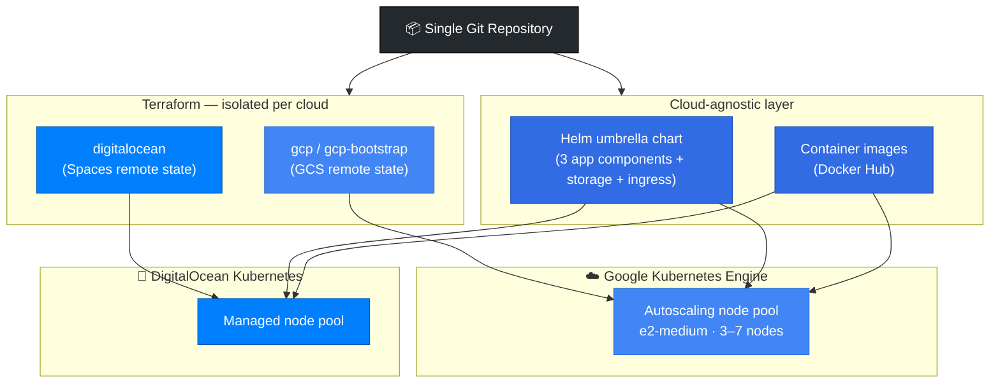
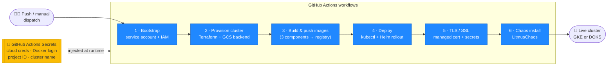
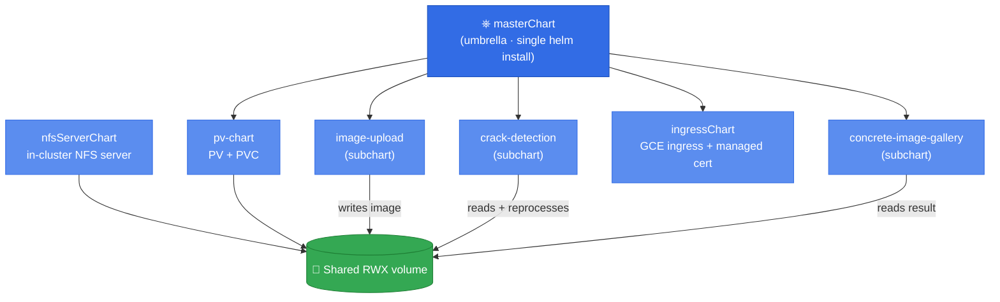
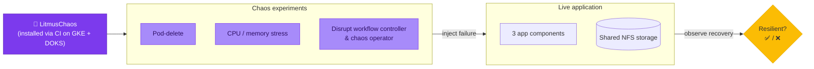

# Shipping a Multi-Cloud Kubernetes Platform: One App, Two Clouds, Zero Manual Steps

*A walkthrough of how I designed and automated a portable, production-shaped platform — and what it taught me about cloud architecture.*

---

When I set out to build this project, the application itself was almost beside the point. The app is a three-part "concrete crack detection" pipeline: a React image-upload front end, a Python service that finds cracks in the uploaded photos, and a Node.js gallery that displays the before-and-after images. Useful, but simple.

The real exercise was the platform underneath it. I wanted to answer a question that comes up constantly in architecture work: *how do you build a deployment that is genuinely cloud-portable, fully automated, and resilient enough to test under failure?* So I built the same application to run on **two clouds** — Google Kubernetes Engine (GKE) and DigitalOcean Kubernetes (DOKS) — from a single repository, with infrastructure-as-code, CI/CD, and chaos testing wired in from the start.

Here's how the four pillars came together.

## 1. Multi-cloud architecture, defined as code

Everything that holds state outside Kubernetes is provisioned with **Terraform**, and the structure is deliberately modular. Each target — `gcp`, `gcp-bootstrap`, and `digitalocean` — lives in its own directory with its own backend, so the GKE stack and the DOKS stack evolve independently without stepping on each other.

The GKE definition is intentionally opinionated: it removes the default node pool and attaches a separately-managed, autoscaling pool (`e2-medium`, scaling 3–7 nodes) so that compute can grow with load without redefining the cluster. Terraform state lives in a remote GCS backend rather than on a laptop, which is the small-but-essential detail that makes the setup safe for more than one person to operate.

The portability payoff shows up at the application layer. Because the workloads are packaged as Helm charts (more on that below) and the only cloud-specific pieces are isolated in Terraform and a handful of provider annotations, moving the same app from Google's L7 load balancer and managed certificates to DigitalOcean's networking is a matter of swapping the deploy target — not rewriting the application.

## 2. CI/CD that automates the whole lifecycle

The repository runs on **GitHub Actions**, and the pipeline covers the entire lifecycle rather than just "build and deploy." There are distinct, purpose-built workflows for each stage:

- **Bootstrap** — creating the GCP service account and IAM roles that everything else depends on
- **Cluster provisioning** — standing up GKE or DOKS through Terraform with the GCS backend
- **Image build and push** — building all three container images and pushing them to a registry
- **Deploy** — pulling the images, configuring `kubectl`, installing Helm, and rolling out the charts
- **TLS / SSL** — provisioning managed certificates and the secrets that back them
- **Chaos install** — deploying the resilience-testing layer

Secrets are handled the way they should be: nothing is hardcoded. Cloud credentials, Docker Hub logins, project IDs, and cluster names all flow through GitHub Actions secrets and are injected at runtime. The Terraform configs reference variables, never literals. That discipline is what let me open-source the project without leaking anything.

One design choice I'm happy with: the GKE deploy workflow automates the *networking* glue most tutorials skip — reserving a global static IP, upserting the Cloud DNS A record for `mahesh.concretecrackgallery.online`, and waiting for the managed certificate to validate before declaring success. The domain itself is registered at Hostinger with its nameservers delegated to GCP Cloud DNS, so the entire path from domain to TLS-terminated load balancer is reproducible from a clean slate.

## 3. A Helm umbrella chart for clean composition

Rather than scatter raw Kubernetes manifests across the repo, I structured the deployment as a **Helm umbrella (master) chart** with subcharts for each concern:

- `image-upload`, `crack-detection`, and `concrete-image-gallery` — one subchart per application component
- `pv-chart` — the PersistentVolume and PersistentVolumeClaim backing shared storage
- `ingressChart` — the GCE ingress plus the managed-certificate resource

A separate `nfsServerChart` provides an NFS server inside the cluster, which gives all three components a shared `ReadWriteMany` volume — the upload service writes an image, the Python service reads and reprocesses it, and the gallery reads the result, all against the same PVC. That shared-storage pattern is the kind of thing that's trivial to describe and surprisingly fiddly to get right, which is exactly why it was worth building.

The umbrella structure means a single `helm upgrade --install` brings up the whole stack, while each subchart stays independently versioned and configurable through its own `values.yaml`. Adding a fourth component later would mean adding a subchart, not refactoring the deployment.

## 4. Chaos engineering with LitmusChaos

A platform that's never been tested under failure is just a platform you haven't broken yet. To close that gap I integrated **LitmusChaos**, installed through its own GitHub Actions workflow on both clouds. Litmus runs experiments against the live cluster — killing pods, injecting resource pressure, disrupting the workflow controller and chaos operator — so I can watch how the application and its shared NFS storage behave when components fail and recover.

Wiring chaos testing in as a first-class, automated step (rather than a one-off manual experiment) reflects how I think resilience should be treated in real systems: as something you verify continuously, not something you hope for.

## What I took away from it

The application is a toy; the platform is not. Building it forced real decisions about state management, secret handling, cloud portability, network and certificate automation, shared storage, and failure testing — the same decisions that scale up to production systems. The result is a repository where someone can go from an empty cloud account to a TLS-secured, multi-component app running on either GKE or DOKS, entirely through automated pipelines, and then deliberately break it to see how it holds up.

That end-to-end ownership — from Terraform state bucket to chaos experiment — is the part I'd want to bring to a platform team.

---

*The full source, Terraform modules, Helm charts, and GitHub Actions workflows are available in the repository. Architecture diagrams (DNS delegation, ingress routing, and the deploy sequence) are included in `platform-architecture.md`.*
