# 🚀 Crack Detection App Infrastructure Deployment on GCP

This project provides a complete setup for provisioning infrastructure on **Google Cloud Platform (GCP)** using **Terraform** and **GitHub Actions**. It includes steps to create a service account, enable required APIs, and deploy a Kubernetes cluster for the Crack Detection application.

---

## 🛠️ Prerequisites

Before running the GitHub Action pipelines, **complete the following steps manually**:

---

## 1️⃣ Create GCP Project

#### For detailed instructions and screenshots, see [GCP Project Setup Guide](/gCloudDockerSetup.md#installing-gcloud).

1. Go to the [Google Cloud Console](https://console.cloud.google.com/).
2. Click on **Project Selector (top bar)** → **New Project**.
3. Name your project (e.g., `concrete-detection`) and click **Create**.
4. **Note down the Project ID** for use in GitHub Secrets.
---

## 2️⃣ Create Service Account

📷 **Screenshot:** Show the service account list after creation.

1. Navigate to **IAM & Admin → Service Accounts**.
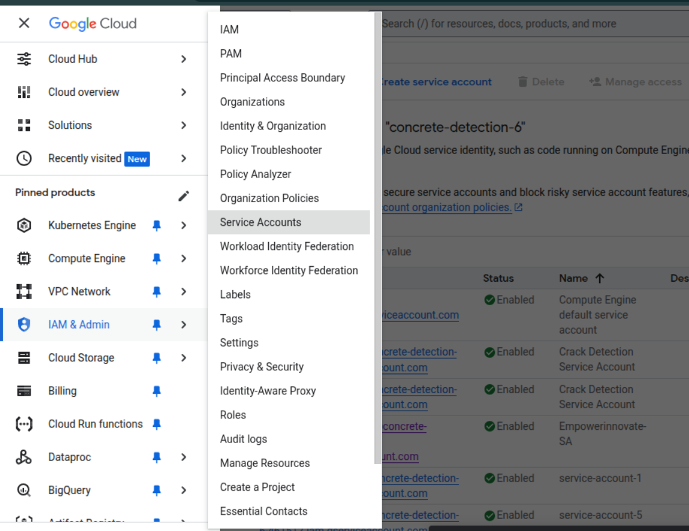
2. Click **Create Service Account**.
   - **Name:** `empowerinnovate-sa`
   - **ID:** `empowerinnovate-sa`
3. Click **Create and Continue**.
4. Assign roles:
   - `Owner`
   - `Service Usage Admin`
   - `Project IAM Admin`
   - `Service Account Admin`
   - `Service Account Key Admin`
5. Click **Done**.

✅ **Expected Output:**  
Service account created and visible:  
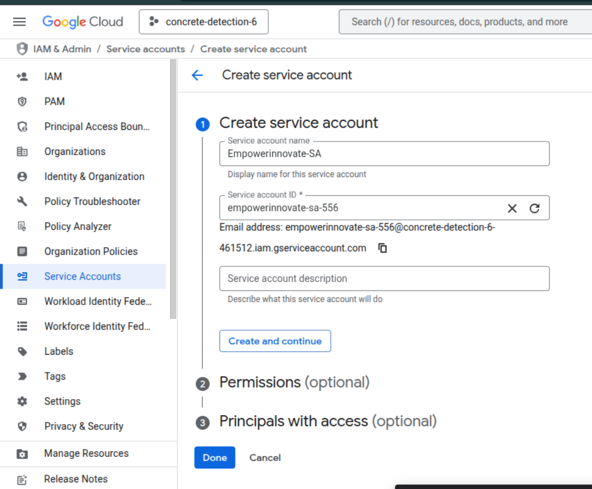
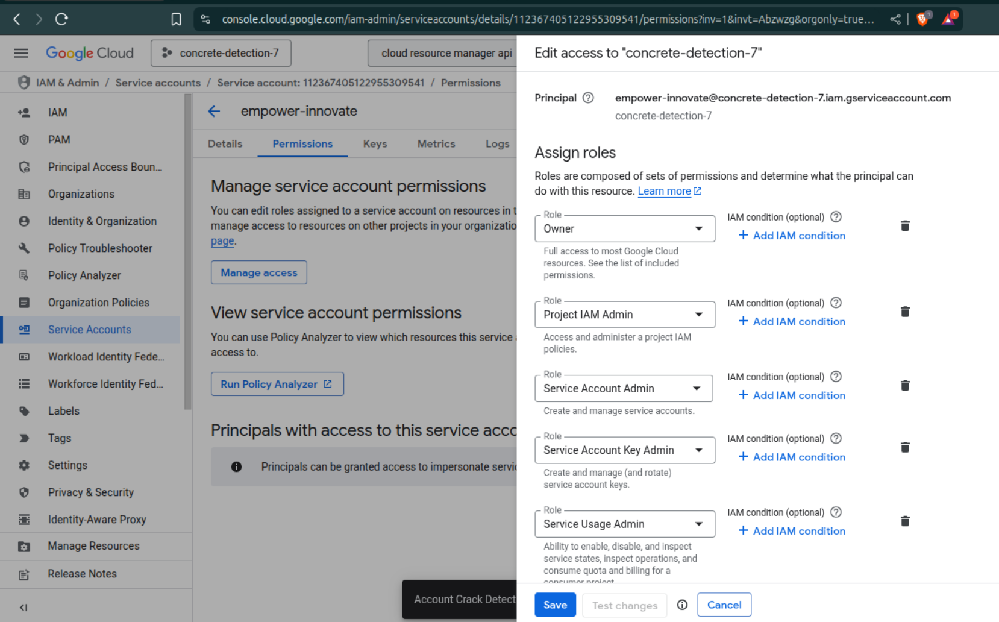
---

## 3️⃣ Create & Download Service Account Key

📷 **Screenshot:** Show download dialog and final JSON key file saved locally.

1. Go to **IAM & Admin → Service Accounts** → Select `empowerinnovate-sa`.
2. Go to the **Keys** tab → **Add Key → Create New Key** → Select **JSON**.
3. Click **Create** and save the JSON file.

✅ **Expected Output:**  
JSON file downloaded:  
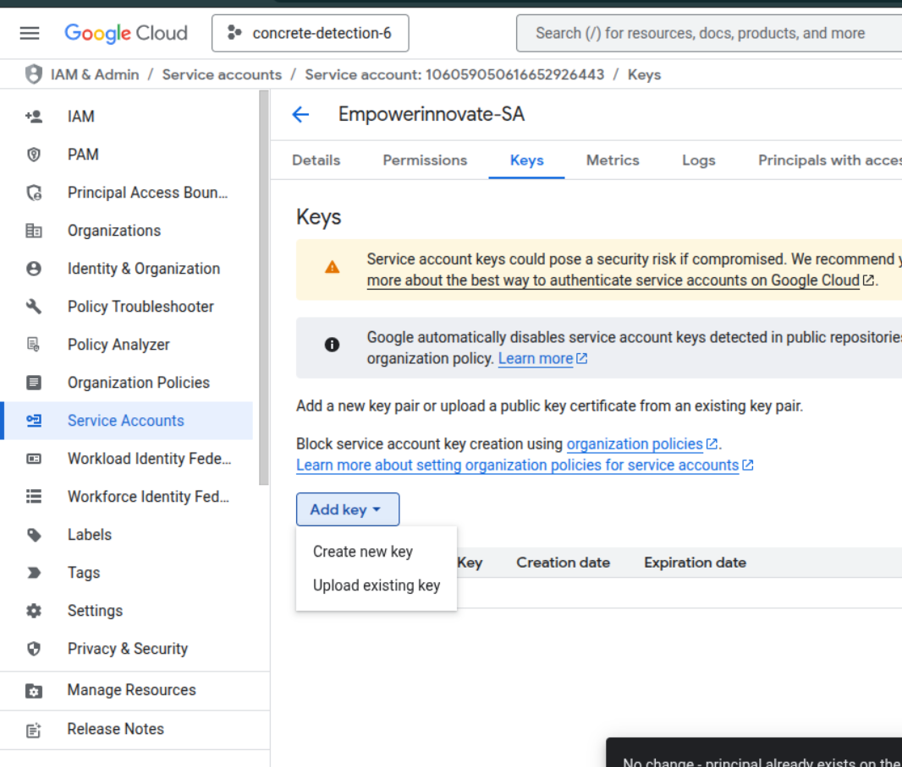
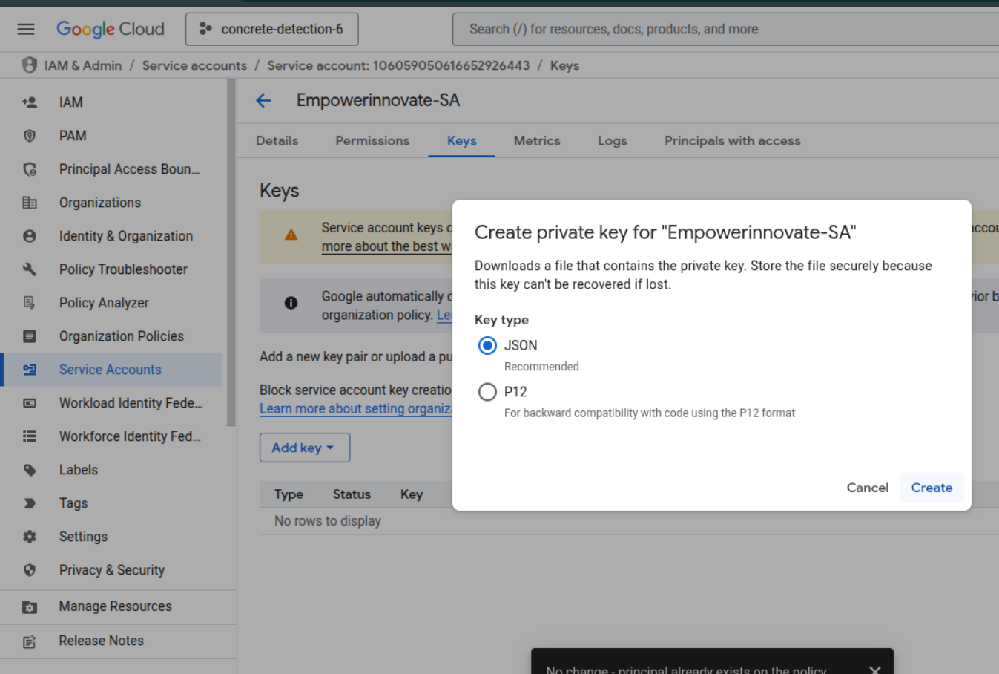
---

## 4️⃣ Create Google Cloud Storage

Navigate to **Cloud Storage → bucket** and create the following bucket:

- `crack-detection-terraform`
 
✅ **Expected Output:**  
📷 **Screenshot:** Show Bucket in the Cloud Storage dashboard.
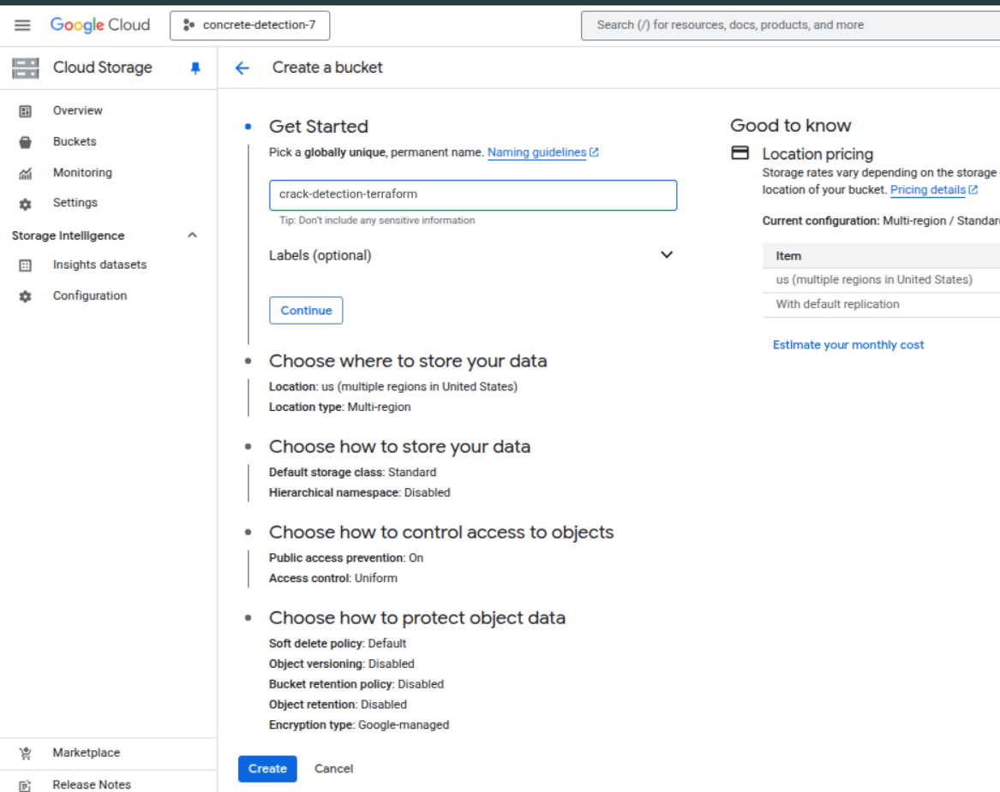

---

## 5️⃣ Add Secrets to GitHub

📷 **Screenshot:** Show GitHub secrets UI with masked value input.

Go to your GitHub repo → **Settings → Secrets and variables → Actions** → **New repository secret**:
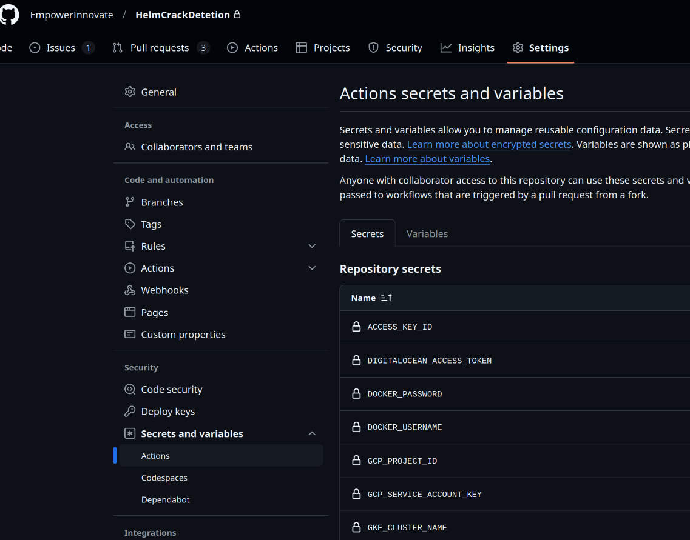

| Secret Name                | Value (Example)                          |
|---------------------------|------------------------------------------|
| `GCP_PROJECT_ID`          | `concrete-detection-6-461512`            |
| `GCP_SERVICE_ACCOUNT_KEY` | Paste content of the JSON key securely   |

🔐 **Note:** No need to base64 encode. GitHub will mask this automatically.

✅ **Expected Output:**  
Secrets added successfully:  
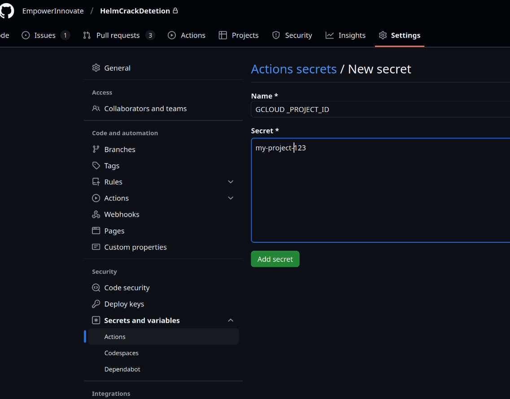

---

## 6️⃣ Run GitHub Action: Create App-Specific Service Account

📷 **Screenshot:** Show GitHub Action being triggered and running.

This GitHub Action pipeline will:

- Create **App-specific Service Account**
- Assign necessary IAM roles

✅ **How to Trigger:**  
Push any changes to the `main` branch or use the **"Run Workflow"** button on GitHub.

✅ **Expected Output:**  
Pipeline starts and completes successfully:  
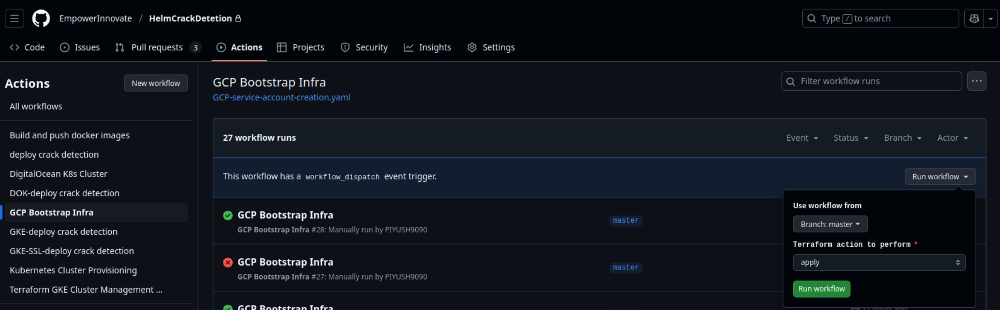
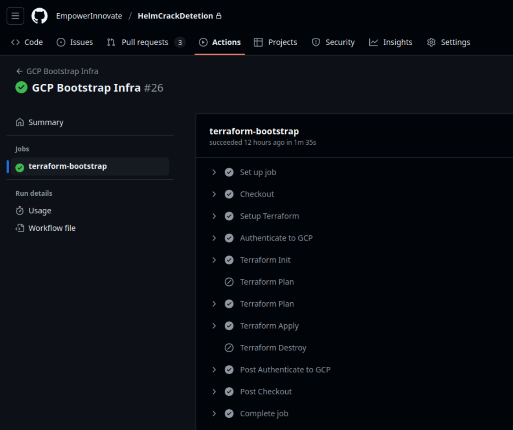

✅ **Verify in GCP:**  
App-specific service account will be visible under **IAM & Admin → Service Accounts**:  
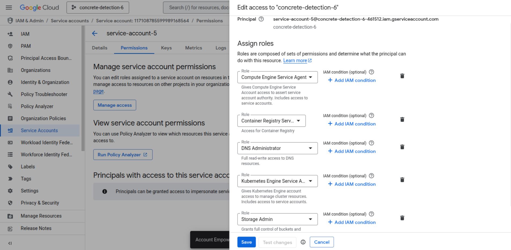

Now follow same [step 3](https://github.com/EmpowerInnovate/HelmCrackDetetion/blob/master/ConcreteDetectionFromScratch.md#3%EF%B8%8F%E2%83%A3-create--download-service-account-key) for this newly created service account.
---

## 7️⃣ Terraform: Provision GKE Cluster

📷 **Screenshot:** Show Terraform provisioning logs from GitHub Actions and GKE dashboard.

The GitHub Action will now run Terraform code to:

- Provision a **GKE Cluster**
- Configure node pools
- Set up basic networking

✅ **Expected Output:**  
Pipeline logs showing successful GKE creation:  
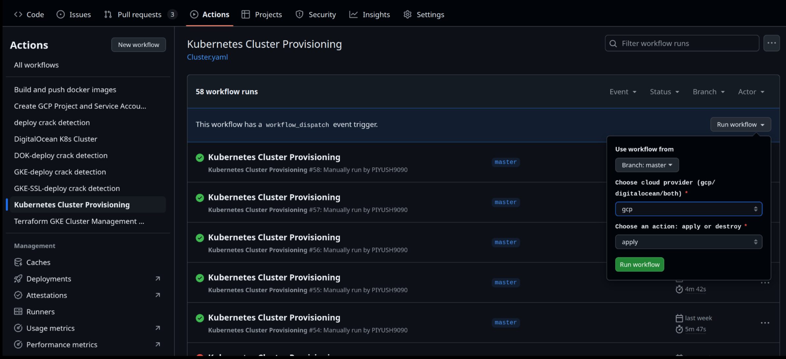
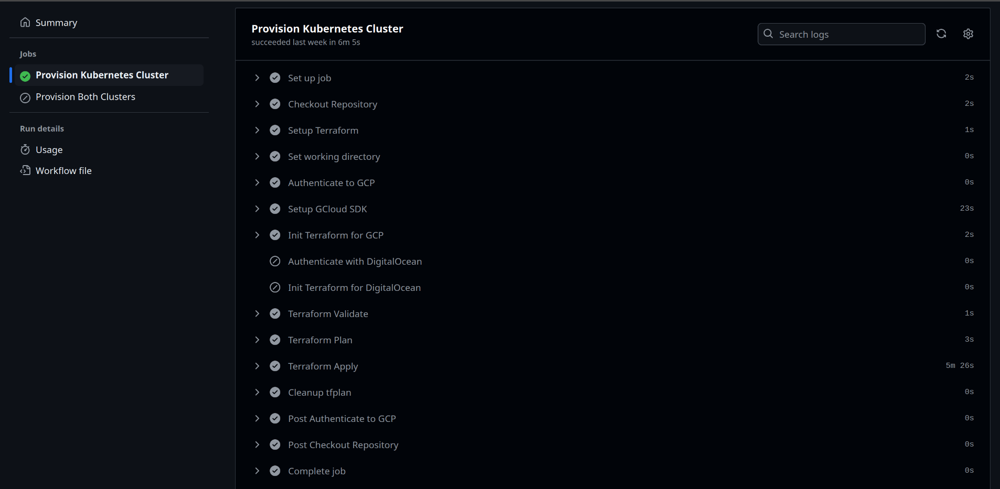

✅ **Verify in GCP:**  
GKE Cluster appears in GCP Console → **Kubernetes Engine → Clusters**:  
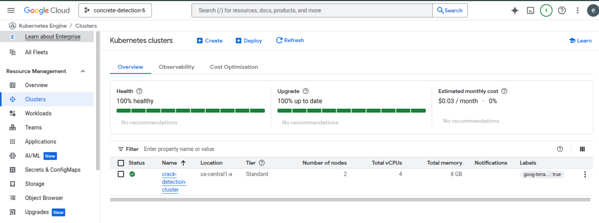

---

## 📦 Deployment Flow Summary

```mermaid
graph LR
A[Create GCP Project] --> B[Create Service Account]
B --> C[Enable APIs]
C --> D[Download & Add Key to GitHub]
D --> E[Run GitHub Action]
E --> F[Create App-Specific SA]
F --> G[Terraform Provisions GKE]
