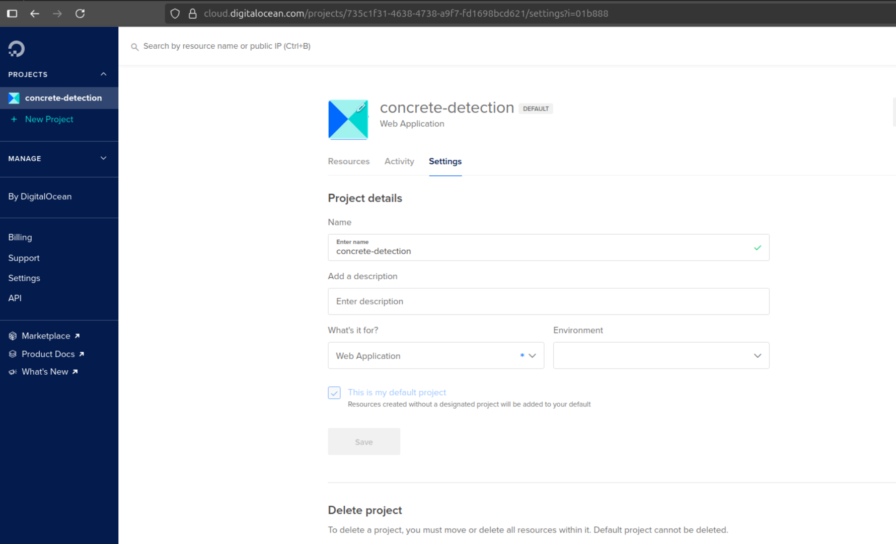
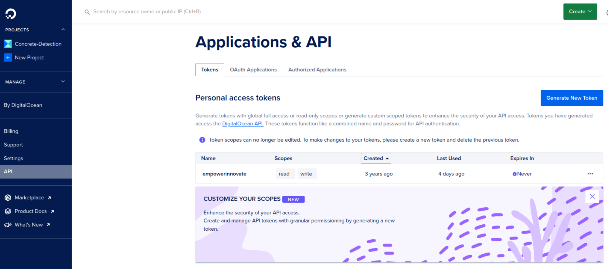
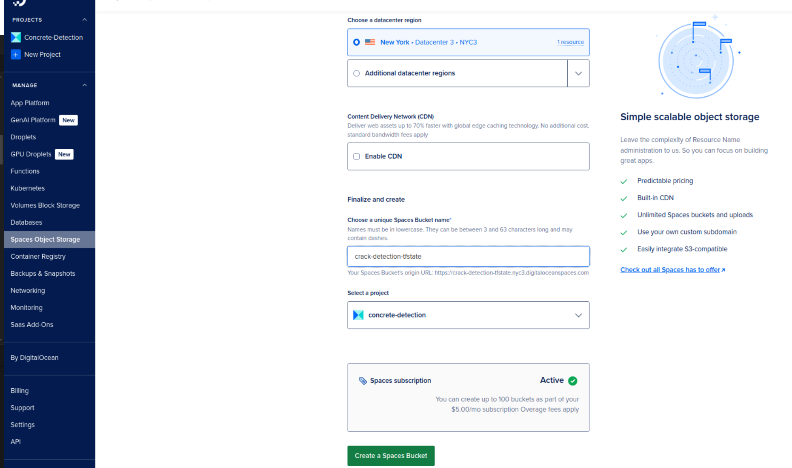
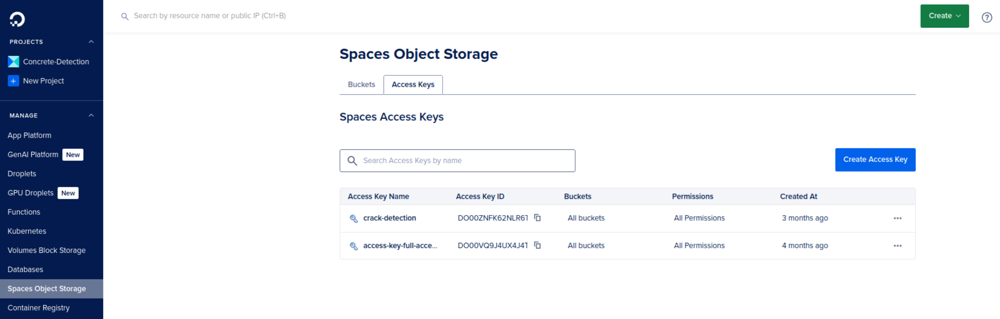
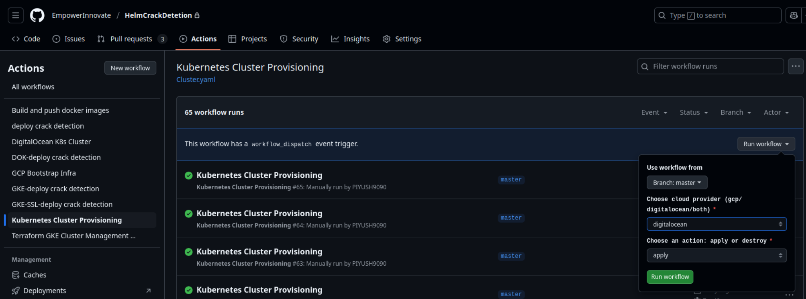
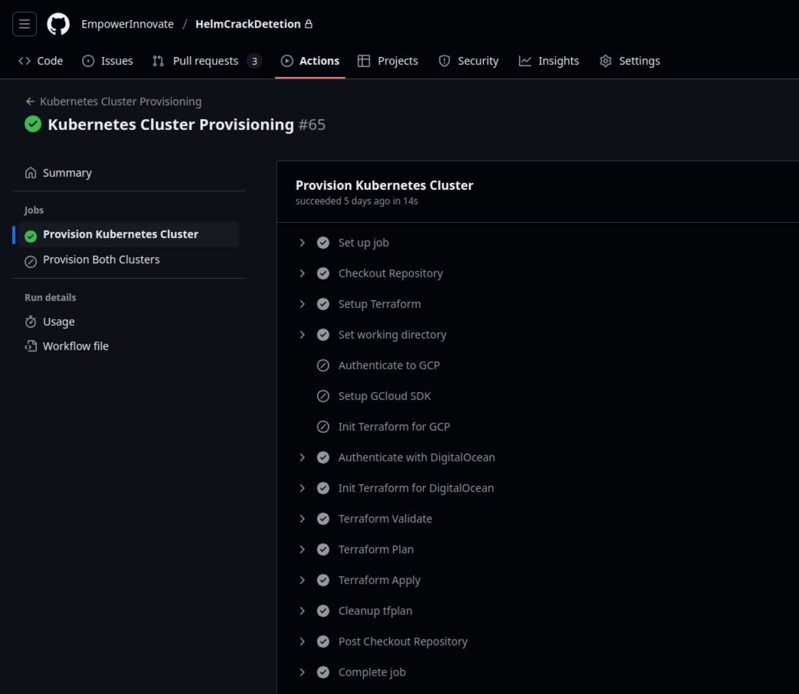
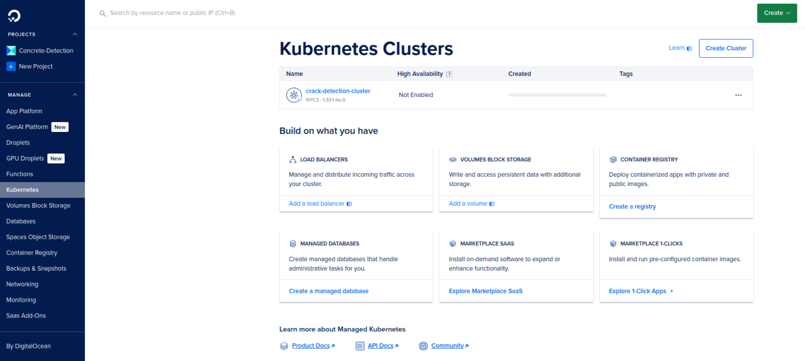
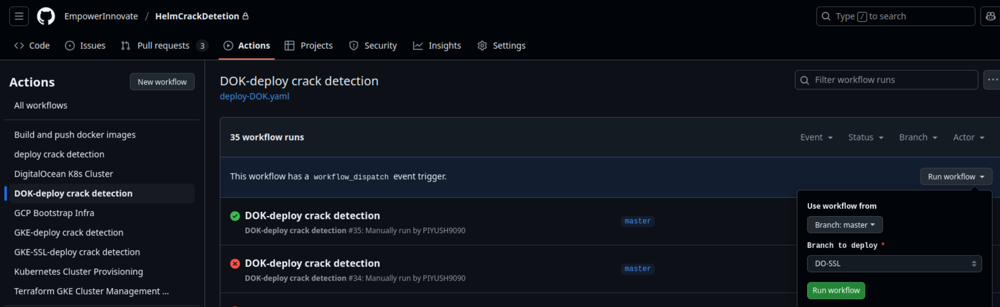
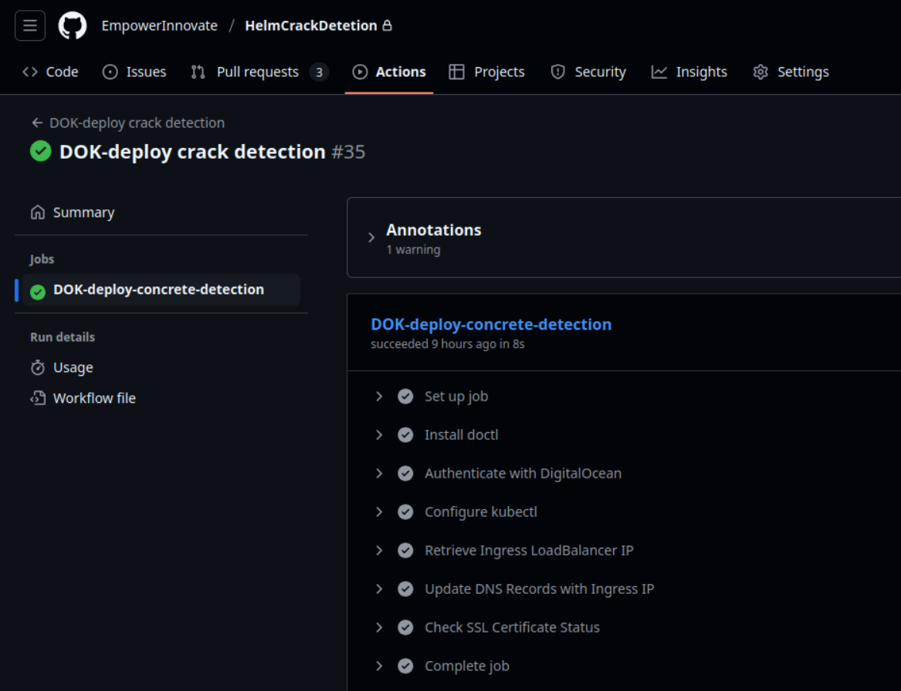
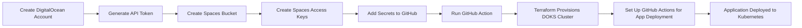

# 🚀 Crack Detection App Infrastructure Deployment on DigitalOcean

This project provides a complete setup for provisioning infrastructure on **DigitalOcean** using **Terraform** and **GitHub Actions**. It includes steps to create a DigitalOcean project, set up API tokens, and deploy a Kubernetes cluster for the Crack Detection application.

---

## 🛠️ Prerequisites

Before running the GitHub Action pipelines, **complete the following steps manually**:

---

## 1️⃣ Create DigitalOcean Account and Project

1. Go to the [DigitalOcean website](https://cloud.digitalocean.com/) and sign up by adding your credit card details, if you don't have an account.
2. Once logged in, navigate to the **Projects** section in the left sidebar.
3. Click **Create Project**.
4. Name your project (e.g., `concrete-detection`) and click **Create**.
5. **Note down the Project ID** for use in GitHub Secrets.


---

## 2️⃣ Generate DigitalOcean API Token

1. Click on bottom-left corner and select **API**.
2. Click **Generate New Token**.
3. Name your token (e.g., `terraform-cicd`).
4. Select **Write** access level.
5. Click **Generate Token**.
6. **Important**: Copy the token and save it securely. You won't be able to see it again.

✅ **Expected Output:**  
A new API token is generated and displayed (only once).


---

## 3️⃣ Create Spaces Bucket for Terraform State

1. In the DigitalOcean dashboard, go to **Spaces** in the left sidebar.
2. Click **Create Spaces Bucket**.
3. Choose a globally unique name (e.g., `crack-detection-tfstate`).
4. Select the region closest to your users.
5. Click **Create a Space**.

✅ **Expected Output:**  
A new Spaces bucket is created and visible in your Spaces dashboard.

---

## 4️⃣ Create Spaces Access Keys

1. In the DigitalOcean dashboard, go to **Spaces Access Keys**.
2. Click **Generate New Key**.
3. Give it a name (e.g., `terraform-spaces-key`).
4. Click **Generate Key**.
5. **Important**: Save both the Key and Secret securely.

✅ **Expected Output:**  
A new Spaces access key pair is generated and displayed (only once).

---

## 5️⃣ Add Secrets to GitHub

Go to your GitHub repo → **Settings → Secrets and variables → Actions** → **New repository secret**:

| Secret Name                | Value (Example)                          |
|---------------------------|------------------------------------------|
| `DIGITALOCEAN_TOKEN`      | Your DigitalOcean API token              |
| `SPACES_ACCESS_KEY_ID`    | Your Spaces Access Key                   |
| `SPACES_SECRET_ACCESS_KEY`| Your Spaces Secret Key                  |
| `TF_VAR_do_token`         | Same as DIGITALOCEAN_TOKEN               |
| `TF_VAR_spaces_access_id` | Same as SPACES_ACCESS_KEY_ID             |
| `TF_VAR_spaces_secret_key`| Same as SPACES_SECRET_ACCESS_KEY         |
| `TF_VAR_cluster_name`     | `crack-detection-cluster`                |
| `TF_VAR_region`           | `nyc3` (or your preferred region)        |

🔐 **Note:** Keep all secrets secure and never commit them to version control.

✅ **Expected Output:**  
All secrets are added to your GitHub repository settings.

---

## 6️⃣ Run GitHub Action: Provision Infrastructure

This GitHub Action pipeline will:

- Initialize Terraform
- Create a DigitalOcean Kubernetes (DOKS) cluster
- Configure necessary resources

✅ **How to Trigger:**  
Push any changes to the `master` branch or use the **"Run Workflow"** button on GitHub.


✅ **Expected Output:**  
Pipeline starts and completes successfully, showing the creation of all resources.


✅ **Verify in DigitalOcean Dashboard:**  
- Go to **Kubernetes** to see your new cluster
- Check **Load Balancers** for any created load balancers
- Verify **Volumes** if any persistent storage was created


---

## 7️⃣ Access Your Kubernetes Cluster

1. Install `doctl` (DigitalOcean CLI) locally:
   ```bash
   # For macOS (using Homebrew)
   brew install doctl
   
   # For Linux (using snap)
   sudo snap install doctl --classic
   ```

2. Authenticate with DigitalOcean:
   ```bash
   doctl auth init
   # Follow the prompts to authenticate
   ```

3. Get your Kubernetes config:
   ```bash
   doctl kubernetes cluster kubeconfig save crack-detection-cluster
   ```

4. Verify access:
   ```bash
   kubectl get nodes
   ```

## 8️⃣ Deploy Application Using GitHub Actions

Now that our Kubernetes cluster is ready, let's set up the GitHub Actions workflow to deploy our application.

1. **Let's run the GitHub action pipeline**
   - In your GitHub repository, go to **Settings → Actions**
   
   - See the pipeline logs
   

✅ **Expected Output:**  
- The GitHub Actions workflow will start automatically
- You'll see the deployment progress in the **Actions** tab
- Once completed, your application will be deployed to the Kubernetes cluster

✅ **Verify in Kubernetes Cluster:**  
```bash
kubectl get pods
kubectl get services
kubectl get ingress
```

---

## 📦 Deployment Flow Summary



## 🔧 Troubleshooting

- **Cluster Creation Fails**: Check your DigitalOcean account limits and billing status.
- **Terraform State Issues**: Verify the Spaces bucket name and credentials.
- **Kubernetes Access Problems**: Ensure `kubectl` is properly configured with the correct context.

## 📚 Additional Resources

- [DigitalOcean Kubernetes Documentation](https://docs.digitalocean.com/products/kubernetes/)
- [Terraform DigitalOcean Provider](https://registry.terraform.io/providers/digitalocean/digitalocean/latest/docs)
- [DigitalOcean API Documentation](https://docs.digitalocean.com/reference/api/)

---

## 👥 Support

For any issues or questions, please open an issue in the repository or contact the maintainers.

## 📄 License

This project is licensed under the MIT License - see the [LICENSE](LICENSE) file for details.
