# Crack Detection — End-to-End Developer Guide (run it on your own accounts)

This is a self-contained, reproducible version of the end-to-end walkthrough, rewritten so
that **a developer with their own GCP and/or DigitalOcean credentials can run it from
scratch**. It assumes no pre-existing project, service account, cluster, bucket, or domain —
you create all of them here.

If you just want to see what the original recording showed, read
[`CrackDetectionEndToEnd.md`](CrackDetectionEndToEnd.md) instead. This guide reuses the same
screenshots but reorganizes the flow and fills in the setup the recording took for granted.

> **The two paths are independent.** GKE (Google Cloud) and DOKS (DigitalOcean) each deploy
> the full app on their own. Do **Part A** *or* **Part B** — you don't need both. Part 0 is
> shared one-time setup.
>
> Authoritative architecture reference: [`platform-architecture.md`](../platform-architecture.md).

---

## Conventions — replace these placeholders

The repo is wired to the original author's resources. Everywhere you see `<...>`, substitute
your own value. These are the ones that matter:

| Placeholder | Meaning | Author's value (do **not** reuse) |
|---|---|---|
| `<YOUR_GCP_PROJECT_ID>` | Your Google Cloud project ID | `concrete-detection-1-491711` |
| `<YOUR_GCS_STATE_BUCKET>` | GCS bucket holding GKE Terraform state | `crack-detection-terraform` |
| `<YOUR_GKE_DOMAIN>` | Domain served by the GKE ingress | `maheshconcretegallery.online` |
| `<YOUR_CLOUD_DNS_ZONE>` | Cloud DNS managed-zone name | `concrete-zone-1` |
| `<YOUR_DO_SPACES_BUCKET>` | DO Spaces bucket for DOKS Terraform state | `terraform-crack-detection-1` |
| `<YOUR_DO_DOMAIN>` | Domain served by the DOKS ingress | `mahesh.concretecrackgallery.in` |
| `<YOUR_CLUSTER_NAME>` | Cluster name you pick | `crack-detection-cluster` |
| `<YOUR_DOCKERHUB_USER>` | DockerHub namespace for the app images | `maheshrajannan` |

> **Heads-up:** a few of these values are **hard-coded inside the workflow YAML**, not just
> passed as inputs. You will edit those files in Part A/B — they're called out where relevant.

---

## Part 0 — One-time setup (shared)

### 0.1 Fork the repo

You can't push to or manage Actions on `maheshrajannan/HelmCrackDetectionV2`. **Fork it** to
your own account (or push a copy to a new repo) so you can set secrets, edit workflow YAML,
and run the workflows.

### 0.2 Install the local tooling

You'll run a few commands locally to connect to clusters and (optionally) bootstrap infra:

- `git`, `base64` (built in on macOS/Linux)
- `gcloud` (Google Cloud CLI) — for the GKE path
- `doctl` (DigitalOcean CLI) — for the DOKS path
- `kubectl` and `helm` — to inspect/verify deployments
- `terraform` — only if you bootstrap infra locally instead of via the workflow

Authenticate the CLIs you'll use: `gcloud auth login` / `gcloud auth application-default login`
and `doctl auth init -t <YOUR_DO_TOKEN>`.

### 0.3 Decide where the container images come from

The deploy workflows pull three images from DockerHub:

```
<YOUR_DOCKERHUB_USER>/image-upload-logic:latest
<YOUR_DOCKERHUB_USER>/crack-detection-logic:latest
<YOUR_DOCKERHUB_USER>/concrete-image-gallery-logic:latest
```

Two options:

1. **Build and push your own** (recommended): run the **Mahesh-Build-concrete-detection**
   workflow (or the scripts under `buildConcreteDetection/`) to build and push all three to
   your own DockerHub namespace.
2. **Reuse the author's public images**: set `<YOUR_DOCKERHUB_USER>` = `maheshrajannan`. The
   workflow still performs a DockerHub login, so you'll need valid DockerHub creds in secrets
   regardless.

> **Note:** The Helm charts use `global.registry` (which defaults to `"$MAHESH_DOCKER_USERNAME"` in `masterChart/values.yaml`, and is overridden to `${{ secrets.MAHESH_DOCKER_USERNAME }}` in the workflows) to automatically prefix the images. You do not need to edit `masterChart/values.yaml` to specify your namespace unless you want to customize the image names themselves.

### 0.4 Create the GitHub Actions secrets

In your fork: **Settings → Secrets and variables → Actions → New repository secret**. Create:

| Secret | Used for | Needed by |
|---|---|---|
| `MAHESH_DOCKER_USERNAME` | DockerHub login **and** image namespace | both deploy workflows |
| `MAHESH_DOCKER_PASSWORD` | DockerHub password / access token | both deploy workflows |
| `MAHESH_DIGITALOCEAN_ACCESS_TOKEN` | DigitalOcean API token | DOKS path |

> The cluster-provision and deploy workflows also accept the GCP SA key, DO token, and Spaces
> keys as **run-time inputs** (typed into the Run-workflow form). Treat those as sensitive —
> they appear in plaintext in the form. Prefer rotating them after a run, or wiring them as
> secrets if you harden the workflows.

### 0.5 You need a domain for the SSL paths

Both deploy workflows are the **SSL** variants — they create/auto-validate TLS certificates
against a real domain and write DNS A records. You must own a domain (or subdomain) for the
path you choose:

- **GKE** uses Google **Cloud DNS** (managed zone) and a GCP Managed Certificate.
- **DOKS** uses **DigitalOcean DNS** (`doctl compute domain records`).

If you don't have a domain, you can still provision the cluster and deploy, but certificate
issuance and the public HTTPS URL won't complete.

---

## Part A — GKE (Google Cloud) path

### A.1 Create a GCP project and enable APIs

Create a project (note its ID as `<YOUR_GCP_PROJECT_ID>`), enable **billing**, and enable the
**Kubernetes Engine**, **Compute Engine**, and **Cloud DNS** APIs:

```bash
gcloud projects create <YOUR_GCP_PROJECT_ID>
gcloud config set project <YOUR_GCP_PROJECT_ID>
gcloud services enable container.googleapis.com compute.googleapis.com dns.googleapis.com
```

### A.2 Create the Terraform state bucket (GCS)

The GKE Terraform backend stores state in a GCS bucket. Create it (globally unique name) and
point the backend at it:

```bash
gcloud storage buckets create gs://<YOUR_GCS_STATE_BUCKET> --location=us-central1
```

Edit **`terraform/gcp-mahesh/backend.tf`** (and `terraform/gcp-bootstrap-mahesh/main.tf`) and
replace the `bucket = "crack-detection-terraform"` line with `<YOUR_GCS_STATE_BUCKET>`.

### A.3 Create the service account, key, and DNS zone

The `terraform/gcp-bootstrap-mahesh` module provisions the **Crack Detection Service Account**
and a **Cloud DNS managed zone** for your domain. Easiest path:

```bash
cd terraform/gcp-bootstrap-mahesh
terraform init
terraform apply \
  -var="dns_zone_name=<YOUR_CLOUD_DNS_ZONE>" \
  -var="dns_domain=<YOUR_GKE_DOMAIN>."
```

Then create a JSON key for that service account (Console: **IAM & Admin → Service Accounts →
your SA → Keys → Add Key → Create new key → JSON**), and download it into the gitignored
`keys/` folder. Grant the SA at least: **Kubernetes Engine Admin**, **Compute Admin**, **DNS
Administrator**, and **Service Account User**.

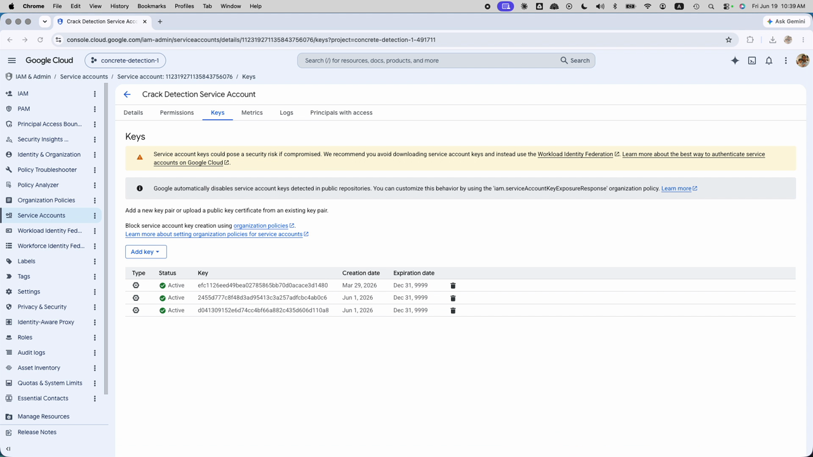

> Never commit the JSON. `keys/` is gitignored for this reason.

### A.4 Encode the SA key as single-line base64

The provision and deploy workflows take the key as a **single-line base64 string**:

```bash
cd keys
# macOS:
base64 -i <YOUR_SA_KEY>.json | tr -d '\n' > key2.txt
# Linux:
base64 -w 0 <YOUR_SA_KEY>.json | tr -d '\n' > key2.txt
cat key2.txt   # copy this whole string into the workflow input
```

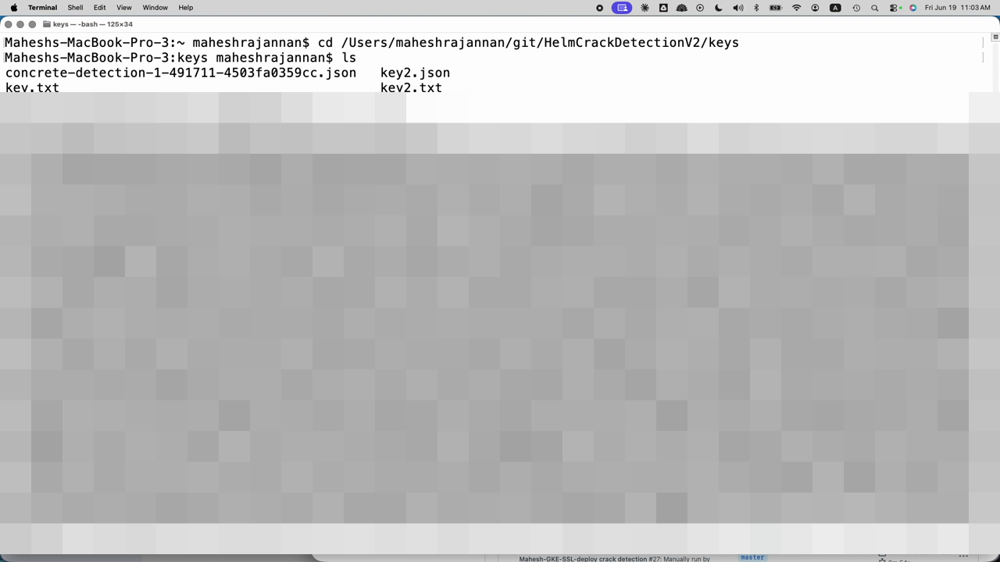

> **Gotcha:** macOS `base64` rejects the Linux `-w 0` flag (`invalid argument`). Use `-i
> <file>` on macOS. And don't paste the literal word "Mac:" into the shell — that's a label,
> not a command.

### A.5 Update the hard-coded domain and DNS zone in the GKE deploy workflow

Open **`.github/workflows/MAHESH_DEPLOY-SSL-GKE.yaml`** and change the hard-coded values
(around the "Update DNS record" step) from the author's to yours:

```yaml
DOMAIN_NAME="<YOUR_GKE_DOMAIN>"      # was maheshconcretegallery.online
DNS_ZONE_NAME="<YOUR_CLOUD_DNS_ZONE>" # was concrete-zone-1
```

The global static IP name (`concrete-detection-ip`) is created automatically if missing —
rename it too if you prefer.

### A.6 Provision the GKE cluster

GitHub → **Actions → Any User Create Kubernetes Cluster → Run workflow**. Set:

- **provider** = `gcp`, **action** = `apply`
- **gcp_project_id** = `<YOUR_GCP_PROJECT_ID>`
- **gcp_sa_key_base64** = the string from A.4
- **cluster_name** = `<YOUR_CLUSTER_NAME>`
- **gcp_cluster_zone** = `us-central1-a` (default)
- **gcp_terraform_dir** = `./terraform/gcp-mahesh` (default)

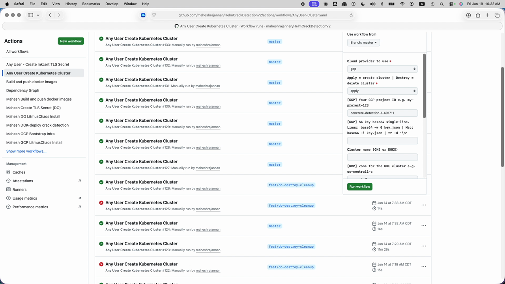

> The same workflow's `action: destroy` is how you tear the cluster down later (see Teardown).

### A.7 Deploy the app to GKE

Run **Mahesh-GKE-SSL-deploy crack detection** (`MAHESH_DEPLOY-SSL-GKE.yaml`). All inputs are
required:

- **gcp_sa_key_base64** = the base64 string from A.4
- **gcp_cluster_name** = `<YOUR_CLUSTER_NAME>`
- **gcp_cluster_zone** = `us-central1-a`
- **gcp_project_id** = `<YOUR_GCP_PROJECT_ID>`

This logs in to DockerHub, pulls your three images, reserves the global static IP, installs
the NFS chart, discovers its ClusterIP, installs the master Helm chart, and creates the
ManagedCertificate + GCE Ingress.

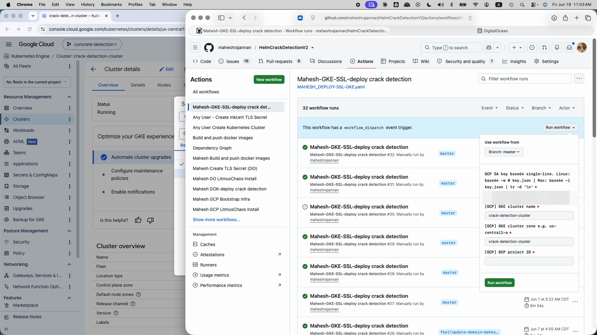

### A.8 Delegate DNS and wait for the certificate

Point your domain registrar's **nameservers** at the Cloud DNS zone's NS records (find them in
**Network Services → Cloud DNS → `<YOUR_CLOUD_DNS_ZONE>`**). The workflow writes the A record
to the static IP; the GCP Managed Certificate then completes HTTP-01 validation. This can take
10–60 minutes to go `ACTIVE`.

### A.9 Verify the GKE cluster and open the app

**Kubernetes Engine → Clusters → `<YOUR_CLUSTER_NAME>`** — confirm status **Running**, zone
`us-central1-a`, node count, and endpoint.

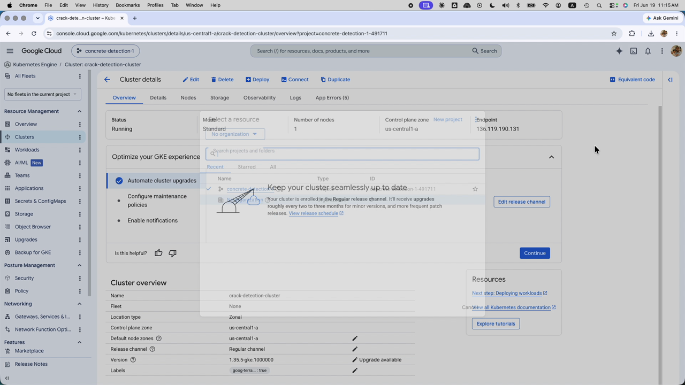

Then open `https://<YOUR_GKE_DOMAIN>/` — you should land on the gallery. Go to `/upload`,
upload a concrete photo, and confirm a processed (`-processed.png`) version appears in the
gallery.

### A.10 Teardown (GKE)

Re-run **Any User Create Kubernetes Cluster** with **provider** = `gcp`, **action** =
`destroy`, same project/cluster inputs. Then delete the static IP and the DNS records if you
won't reuse them.

---

## Part B — DigitalOcean (DOKS) path

### B.1 Create a DO account and API token

Sign in to DigitalOcean (Google/GitHub SSO both work). Create a **Personal Access Token**
(API → Tokens) with read/write scope; save it as `<YOUR_DO_TOKEN>` and as the
`MAHESH_DIGITALOCEAN_ACCESS_TOKEN` secret.

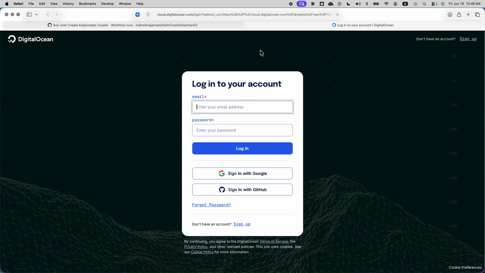

### B.2 Create a Spaces bucket + access key (Terraform backend)

The DOKS Terraform backend uses an S3-compatible **Spaces** bucket (`nyc3` region). Create the
bucket, then **Spaces Object Storage → Access Keys → Create Access Key**, scope it to that
bucket (Full Access is simplest), and name it.

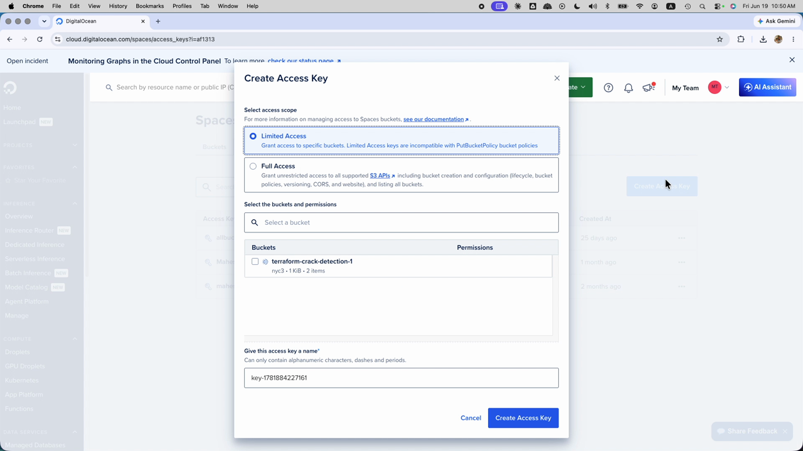

**Copy the secret key immediately** — DigitalOcean shows it once. You'll pass the access key ID
and secret into the provision workflow.

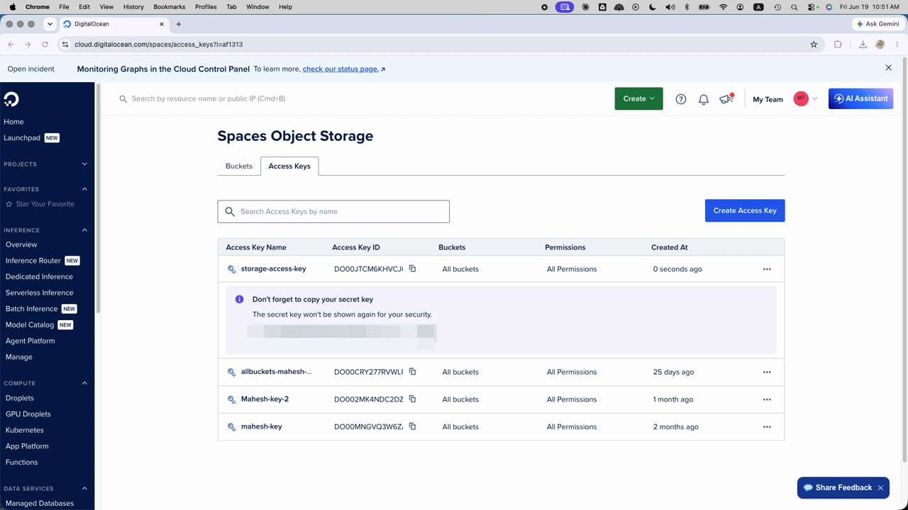

Edit **`terraform/digitalocean-mahesh/backend.tf`** so `bucket = "<YOUR_DO_SPACES_BUCKET>"`
(and the `endpoints`/`region` if you don't use `nyc3`).

### B.3 Add your domain to DigitalOcean and update the DOK workflow

In DO, **Networking → Domains**, add `<YOUR_DO_DOMAIN>`. Then open
**`.github/workflows/Mahesh-deploy-DOK.yaml`** and change the hard-coded domain (around the
"Fetching existing A record" step):

```yaml
DOMAIN: "<YOUR_DO_DOMAIN>"   # was mahesh.concretecrackgallery.in
```

### B.4 Provision the DOKS cluster

GitHub → **Actions → Any User Create Kubernetes Cluster → Run workflow**. Set:

- **provider** = `digitalocean`, **action** = `apply`
- **cluster_name** = `<YOUR_CLUSTER_NAME>`
- **do_token** = `<YOUR_DO_TOKEN>`
- **do_access_key** / **do_secret_key** = the Spaces keys from B.2
- **do_terraform_dir** = `./terraform/digitalocean-mahesh` (default)

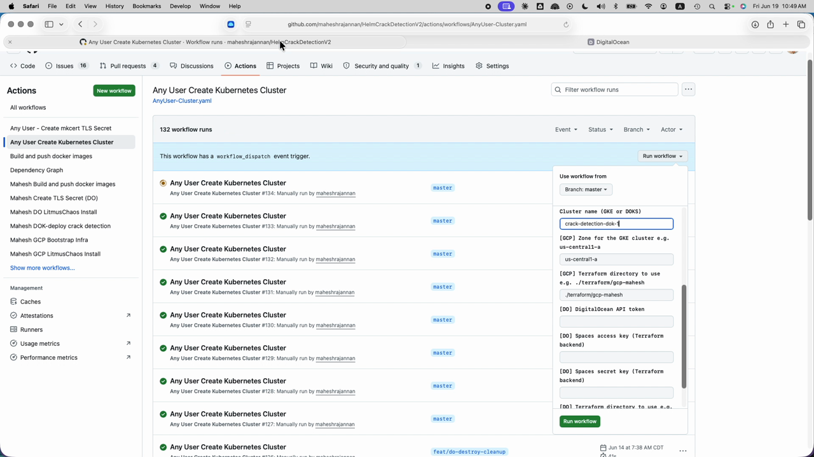

### B.5 Deploy the app to DOKS

Run **Mahesh DOK-deploy crack detection** (`Mahesh-deploy-DOK.yaml`). Its inputs:

- **branch** = `DO-SSL` (this is a **workflow input**, default already `DO-SSL` — leave it
  unless you're testing `feat/cert-manager-lets-encrypt-do`)
- **do_token** = `<YOUR_DO_TOKEN>`
- **cluster_name** = `<YOUR_CLUSTER_NAME>`

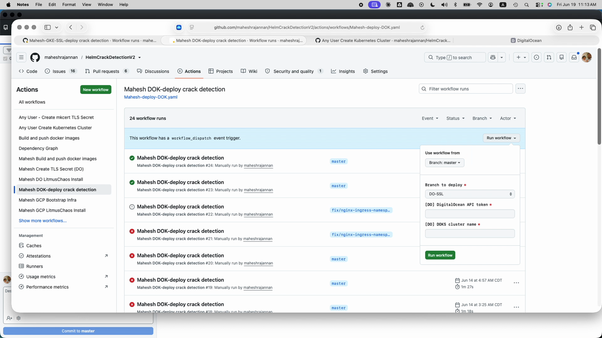

> **About the branch:** the DOKS deploy lives on the `DO-SSL` branch and the workflow exposes
> a `branch` input that defaults to it — so you select it *in the form*, not via a separate
> git checkout. (In the original recording this looked like a manual branch switch; it isn't.)

### B.6 Watch the run

Open the run and follow the job. You'll see the Terraform lifecycle (`init → validate → plan →
apply`), the DigitalOcean pre-destroy cleanup steps (install `doctl`, delete DO LoadBalancers
and Block Storage Volumes via the API), and the step that **outputs the cluster connect
command**.

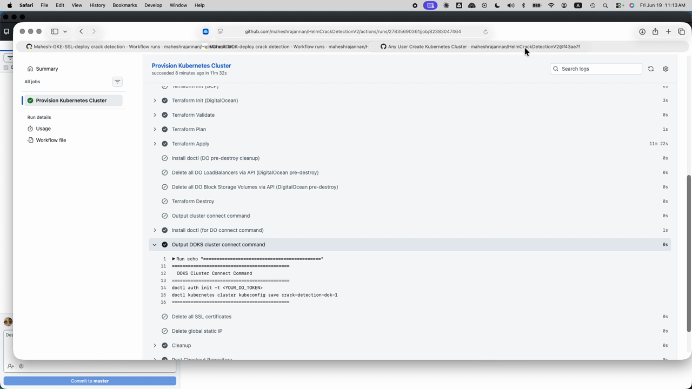

> If you see `Terraform Destroy` steps in this graph, that's the cluster workflow's **destroy**
> path (driven by the `action` input) — it only runs on a destroy, not on an `apply` deploy.

### B.7 Connect with `doctl` and verify

Use the connect command the run printed:

```bash
doctl auth init -t <YOUR_DO_TOKEN>
doctl kubernetes cluster kubeconfig save <YOUR_CLUSTER_NAME>
```

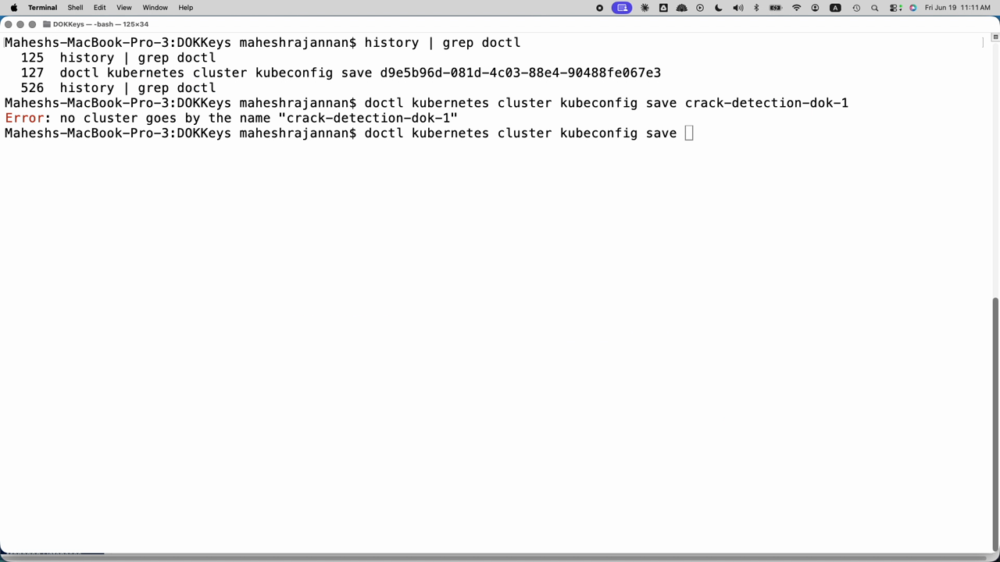

> **Gotcha:** `kubeconfig save` needs the **exact** cluster name or ID. `Error: no cluster
> goes by the name "..."` means it's wrong — list with `doctl kubernetes cluster list` and
> retry with the right name/ID.

Confirm the cluster in **DigitalOcean → Kubernetes** (region/version, Running):

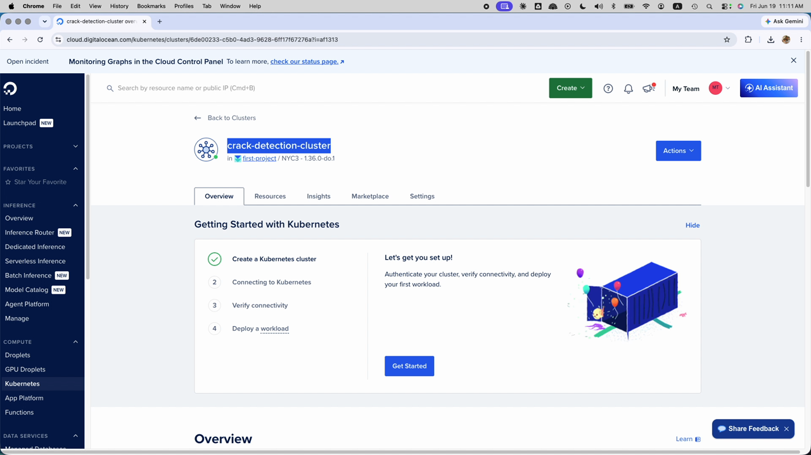

Then open `https://<YOUR_DO_DOMAIN>/` and run the same upload test as A.9.

### B.8 Teardown (DOKS)

Re-run **Any User Create Kubernetes Cluster** with **provider** = `digitalocean`, **action** =
`destroy`. The workflow deletes DO LoadBalancers and Block Storage Volumes before `terraform
destroy` (orphaned LBs/volumes otherwise block cluster deletion and keep billing).

---

## Gotchas worth knowing before you start

- **GCE Ingress requires `NodePort` services.** A `ClusterIP` service breaks load-balancer
  backend sync. `crack-detection-svc` is deliberately `ClusterIP` because it's internal-only
  (no ingress path) — leave it as is.
- **NFS uses `emptyDir`, not a persistent disk.** Uploaded images are **lost if the NFS pod
  restarts.** Fine for a demo; don't treat it as durable storage.
- **Run-workflow inputs are plaintext.** SA keys, DO tokens, and Spaces secrets typed into the
  form are visible in the UI. Rotate after testing, or move them to secrets.
- **`ingressChart` is not wired as a `masterChart` dependency** — it's managed separately. Don't
  expect `helm dependency update` on the master chart to pull it in.
- **Validate before applying.** `helm template` / `helm lint` for chart changes; `terraform
  validate` / `plan` for infra changes.

---

## What you end up with

- A running GKE **or** DOKS cluster named `<YOUR_CLUSTER_NAME>`.
- The three app components from the master Helm chart — upload (`:8080`), crack-detection
  (`:8081`, internal ClusterIP), gallery (`:8082`) — sharing one NFS-backed PVC.
- A public HTTPS gallery at `<YOUR_GKE_DOMAIN>` (GCE Ingress + Managed Certificate) or
  `<YOUR_DO_DOMAIN>` (DOKS ingress).

**Runtime flow:** the upload pod writes an image → the crack-detection pod processes it
(`x.png` → `x-processed.png`) → the gallery pod serves original vs processed side by side.

---

*Screenshots are reused from the `CrackDetectionsEndToEnd.mov` recording; the surrounding
steps were reconstructed from the repo's workflows (`AnyUser-Cluster.yaml`,
`MAHESH_DEPLOY-SSL-GKE.yaml`, `Mahesh-deploy-DOK.yaml`), the Terraform backends, and
`platform-architecture.md`. Verify exact input names against the live workflow forms before
running.*
