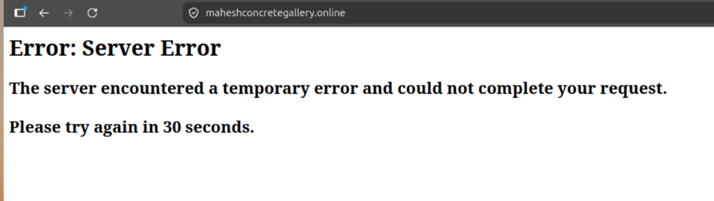
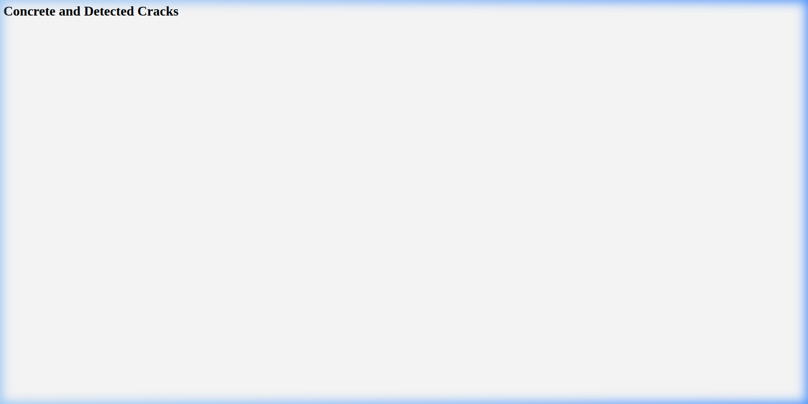
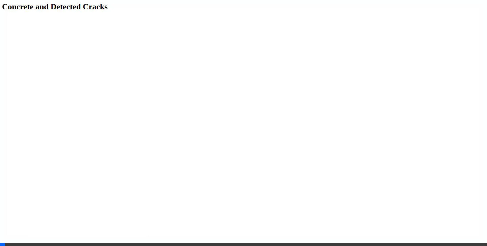

# Root Cause Analysis (RCA) - maheshconcretegallery.online Server Error

**Date:** June 29, 2026  
**Status:** Resolved  
**Incident Domain:** `maheshconcretegallery.online`

---

## 1. Problem Description
Users attempting to access `maheshconcretegallery.online` received a standard Google Frontend (GFE) error page:
> **Error: Server Error**  
> The server encountered a temporary error and could not complete your request. Please try again in 30 seconds.

### Error Screenshot


---

## 2. Root Cause Analysis (RCA)

### Root Cause 1: Regional GCE NEG Quota Exhausted (`NETWORK_ENDPOINT_GROUPS`)
* **Trigger:** Repeated provisioning and teardown of GKE clusters and namespaces (via CI/CD pipelines or manual runs) without cleaning up the Kubernetes `Ingress` and `Service` resources *before* deleting GKE nodes or clusters.
* **Mechanism:** When a GKE cluster is deleted forcefully, the GKE controller does not have time to delete the associated Google Compute Engine (GCE) load balancers, backend services, and Network Endpoint Groups (NEGs) it created. These resources become "orphaned" in the GCP project.
* **Impact:** The project accumulated **101 orphaned NEGs** in region `us-central1`, exceeding the default regional quota limit of 100. When the current cluster attempted to create its NEGs, the GKE `neg-controller` was blocked.
* **Logged Error (obtained via `kubectl describe svc concrete-image-gallery-svc-lb`):**
  ```text
  Warning  SyncNetworkEndpointGroupFailed  neg-controller  Failed to sync NEG "k8s1-33a31ddd-default-concrete-image-gallery-svc-l-808-37ffc26f" (will not retry): failed to get NEG for service: googleapi: Error 403: QUOTA_EXCEEDED - Quota 'NETWORK_ENDPOINT_GROUPS' exceeded.  Limit: 100.0 in region us-central1.
  ```

### Root Cause 2: Immutable PersistentVolume Source (NFS ClusterIP Change)
* **Trigger:** During redeployment, the NFS server service was recreated, resulting in a new ClusterIP (`34.118.230.93`). A python helper script `populateCIP.py` updated this new IP address in `masterChart/charts/pv-chart/values.yaml`.
* **Mechanism:** Kubernetes `PersistentVolume` sources (specifically `spec.persistentVolumeSource.nfs.Server`) are immutable after initial creation. 
* **Impact:** Helm upgrades failed when trying to apply the updated server IP directly to the active PV. The application pods hung in `ContainerCreating` state and threw mount timeout errors because the volume was still pointing to the old unreachable NFS IP (`34.118.233.237`).
* **Logged Error (obtained during `helm upgrade`):**
  ```text
  Error: UPGRADE FAILED: cannot patch "concrete-images-pv-nfs" with kind PersistentVolume: PersistentVolume "concrete-images-pv-nfs" is invalid: spec.persistentvolumesource: Forbidden: spec.persistentvolumesource is immutable after creation
  ```

---

## 3. Corrective Actions Taken

### Step 1: Cleaned up Orphaned GCP Resources
1. Listed the NEGs:
   ```bash
   gcloud compute network-endpoint-groups list --project concrete-detection-1-491711
   ```
2. Executed a concurrent thread-pool cleanup script to delete the 99 orphaned NEGs.
3. Manually deleted the 2 remaining orphaned backend services and their associated NEGs:
   ```bash
   # Delete stale backend services
   gcloud compute backend-services delete k8s1-9af540b1-default-image-upload-svc-lb-8080-428c3968 --global --quiet --project=concrete-detection-1-491711
   gcloud compute backend-services delete k8s1-9af540b1-kube-system-default-http-backend-80-12fcff5f --global --quiet --project=concrete-detection-1-491711
   
   # Delete stale NEGs
   gcloud compute network-endpoint-groups delete k8s1-9af540b1-default-image-upload-svc-lb-8080-428c3968 --zone=us-central1-a --quiet --project=concrete-detection-1-491711
   gcloud compute network-endpoint-groups delete k8s1-9af540b1-kube-system-default-http-backend-80-12fcff5f --zone=us-central1-a --quiet --project=concrete-detection-1-491711
   ```

### Step 2: Recreated the PersistentVolume & PVC
To update the immutable NFS service IP, we had to delete the active resources and let Helm recreate them:
1. Deleted the deployments holding volume locks:
   ```bash
   kubectl delete deployment concrete-image-gallery-depl image-upload-depl crack-detection-depl
   ```
2. Deleted the PVC and PV:
   ```bash
   kubectl delete pvc concrete-images-pvc-nfs
   kubectl delete pv concrete-images-pv-nfs
   ```
3. Re-ran `populateCIP.py` and redeployed the Helm chart:
   ```bash
   python3 populateCIP.py
   helm upgrade --install master-chart ./masterChart
   ```

---

## 4. Verification & Validation

1. **Pod Status:** Verified all pods transitioned successfully to `Running` (1/1 Ready):
   ```bash
   kubectl get pods
   ```
2. **Backend Health Status:** Verified that GCE backends are healthy:
   ```bash
   gcloud compute backend-services get-health k8s1-33a31ddd-default-concrete-image-gallery-svc-l-808-37ffc26f --global --project=concrete-detection-1-491711
   ```
3. **HTTP/HTTPS Reachability:** Verified the domain returns `200 OK` via SSL:
   ```bash
   curl -Iv https://maheshconcretegallery.online/
   curl -Iv https://maheshconcretegallery.online/upload
   ```

### Verification Screenshots
* **Resolved Gallery Web Interface**:


* **Interactive Page Verification Video/GIF**:


---

## 5. Prevention & Future Mitigation (Implemented Changes)

To prevent these issues from recurring on future cluster deployments or destructions, we implemented the following changes:

### A. Dynamic NFS ClusterIP Discovery (No `populateCIP.py` file dirtying)
* **Problem:** Running a local python file (`populateCIP.py`) to rewrite `masterChart/charts/pv-chart/values.yaml` before deployment resulted in file drift and dirty checkouts.
* **Resolution:** Changed the Helm chart default to `nfsCIP: ""` and modified `.github/workflows/MAHESH_DEPLOY-SSL-GKE.yaml` to dynamically fetch the IP and pass it directly to Helm at runtime:
  ```yaml
      run: |
        helm upgrade --install nfs-server ./nfsServerChart
        sleep 3
        NFS_CIP=$(kubectl get svc nfs-server-svc-cip -o jsonpath='{.spec.clusterIP}')
        if [[ -z "$NFS_CIP" ]]; then
          echo "ERROR: could not discover nfs-server-svc-cip ClusterIP" >&2
          exit 1
        fi
        echo "NFS ClusterIP: $NFS_CIP"
        sleep 3
        helm upgrade --install master-chart ./masterChart --set pv-chart.nfsCIP="$NFS_CIP"
        sleep 5
  ```

### B. Automated Pre-Destroy Cleanup of GCE Ingress & NEGs
* **Problem:** Destroying the cluster via Terraform left orphaned Load Balancers, Backend Services, and NEGs in GCP.
* **Resolution:** Added a `GKE Pre-Destroy Cleanup (GCP)` step in the `.github/workflows/AnyUser-Cluster.yaml` workflow. Before GKE is destroyed by Terraform, the workflow connects to the cluster and uninstalls Helm releases, deletes all ingresses/services to let the GKE controllers gracefully clean up cloud load balancing resources, and finally uses `gcloud` to delete any remaining orphaned NEGs:
  ```yaml
      - name: GKE Pre-Destroy Cleanup (GCP)
        if: ${{ github.event.inputs.action == 'destroy' && github.event.inputs.provider == 'gcp' }}
        run: |
          gcloud container clusters get-credentials "${{ github.event.inputs.cluster_name }}" --zone "${{ github.event.inputs.gcp_cluster_zone }}" --project "${{ github.event.inputs.gcp_project_id }}" || true
          helm list -A -q | xargs -I {} helm uninstall {} || true
          kubectl delete ingress --all --all-namespaces || true
          kubectl delete svc --all --all-namespaces --field-selector metadata.name!=kubernetes || true
          sleep 60
          # Force delete remaining orphaned NEGs
          ZONE="${{ github.event.inputs.gcp_cluster_zone }}"
          PROJECT="${{ github.event.inputs.gcp_project_id }}"
          NEGS=$(gcloud compute network-endpoint-groups list --zone="$ZONE" --project="$PROJECT" --format="value(name)" 2>/dev/null || true)
          if [[ -n "$NEGS" ]]; then
            for NEG in $NEGS; do
              gcloud compute backend-services delete "$NEG" --global --quiet --project="$PROJECT" || true
              gcloud compute network-endpoint-groups delete "$NEG" --zone="$ZONE" --quiet --project="$PROJECT" || true
            done
          fi
  ```
