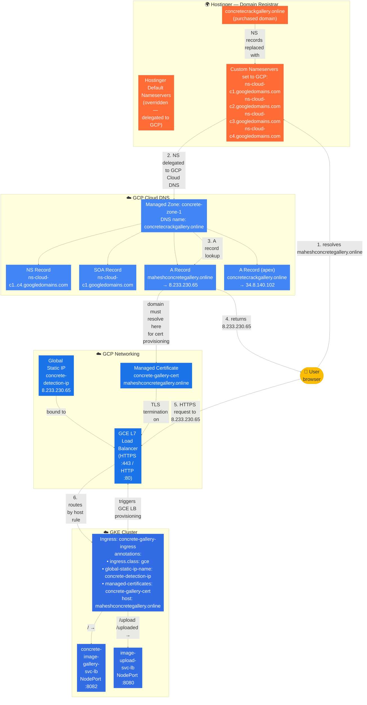
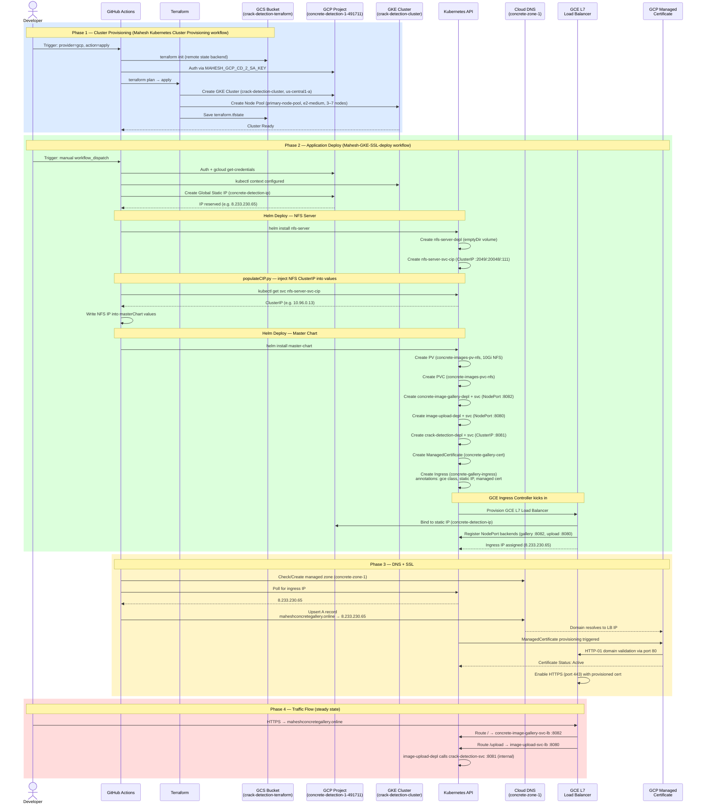
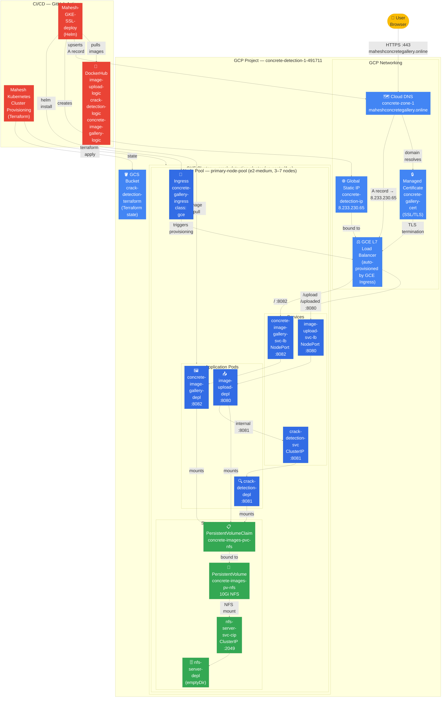

# Platform Architecture — Helm Crack Detection V2

## Resource Inventory

| Layer | Resource | Name |
|---|---|---|
| GCP Infra (Terraform) | GCS Bucket (TF state) | `crack-detection-terraform` |
| GCP Infra (Terraform) | GKE Cluster | `crack-detection-cluster` (us-central1-a) |
| GCP Infra (Terraform) | Node Pool | `primary-node-pool` (e2-medium, 3-7 nodes) |
| GCP Infra (Deploy WF) | Global Static IP | `concrete-detection-ip` |
| GCP Infra (Deploy WF) | Cloud DNS Zone | `concrete-zone-1` |
| GCP Infra (Deploy WF) | DNS A Record | `maheshconcretegallery.online → IP` |
| GCP Infra (K8s) | GCE L7 Load Balancer | auto-created by GCE Ingress controller |
| GCP Infra (K8s) | Managed SSL Cert | `concrete-gallery-cert` |
| K8s / Helm | Ingress | `concrete-gallery-ingress` |
| K8s / Helm | NFS Server Deployment | `nfs-server-depl` |
| K8s / Helm | NFS Service (ClusterIP) | `nfs-server-svc-cip` |
| K8s / Helm | PersistentVolume | `concrete-images-pv-nfs` (10Gi, NFS) |
| K8s / Helm | PersistentVolumeClaim | `concrete-images-pvc-nfs` |
| K8s / Helm | Deployment | `concrete-image-gallery-depl` |
| K8s / Helm | Deployment | `image-upload-depl` |
| K8s / Helm | Deployment | `crack-detection-depl` |
| K8s / Helm | Service (NodePort) | `concrete-image-gallery-svc-lb` :8082 |
| K8s / Helm | Service (NodePort) | `image-upload-svc-lb` :8080 |
| K8s / Helm | Service (ClusterIP) | `crack-detection-svc` :8081 |

---

## Domain to Ingress Mapping

### How the delegation works

| Step | What happens |
|---|---|
| 1 | `concretecrackgallery.online` is purchased and registered at **Hostinger** |
| 2 | In Hostinger's DNS settings, the default nameservers are **replaced** with GCP's: `ns-cloud-c1..c4.googledomains.com` |
| 3 | All DNS queries for `*.concretecrackgallery.online` are now answered by **GCP Cloud DNS** (`concrete-zone-1`) |
| 4 | GCP Cloud DNS holds the A record: `maheshconcretegallery.online → 8.233.230.65` |
| 5 | `8.233.230.65` is the **reserved global static IP** (`concrete-detection-ip`) bound to the GCE L7 Load Balancer |
| 6 | The Load Balancer was provisioned by the **GCE Ingress controller** reading the `concrete-gallery-ingress` annotations |
| 7 | Traffic is routed by the ingress host rule to the appropriate **NodePort services** inside GKE |

> **Note:** The apex domain `concretecrackgallery.online` has a separate A record pointing to `34.8.140.102` — this is not managed by this stack and routes elsewhere.

---

## Sequence Diagram

---

## System Diagram

---

## Notes

- `crack-detection-svc` is internal-only (ClusterIP, no ingress path) — called service-to-service from the upload pod
- The NFS server uses `emptyDir` (not a persistent disk), so **uploaded images are lost if the NFS pod restarts**
- The `concretecrackgallery.online` apex domain A record points to a different IP (`34.8.140.102`) which is not managed by this stack
- GCE Ingress requires `NodePort` services — `ClusterIP` services will cause the load balancer backend sync to fail
