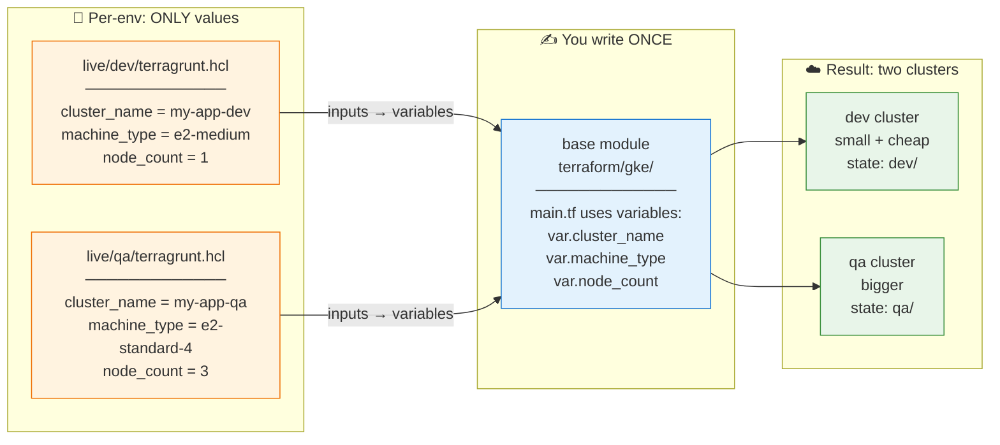
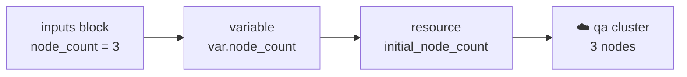

# Terragrunt Basics: One Module, Two Environments (dev / qa)

The whole idea in one sentence: **write the Terraform once, feed it different values per environment.**



Same blue box, two orange value-files, two green clusters. That's Terragrunt.

## The files

```
terraform/gke/main.tf       # base module — written once
live/
  root.hcl                  # backend (state bucket) — written once
  dev/terragrunt.hcl        # dev values
  qa/terragrunt.hcl         # qa values
```

**Base module** — variables instead of hardcoded values:

```hcl
# terraform/gke/main.tf
variable "cluster_name" {}
variable "machine_type" {}
variable "node_count"   {}

resource "google_container_cluster" "this" {
  name               = var.cluster_name
  location           = "us-central1-a"
  initial_node_count = var.node_count
  node_config { machine_type = var.machine_type }
}
```

**Root** — state bucket, defined once; each env gets its own state folder automatically:

```hcl
# live/root.hcl
remote_state {
  backend  = "gcs"
  generate = { path = "backend.tf", if_exists = "overwrite" }
  config = {
    bucket = "my-terraform-state"
    prefix = path_relative_to_include()   # dev/ for dev, qa/ for qa
  }
}
```

**Environments** — identical shape, different values:

```hcl
# live/dev/terragrunt.hcl
include "root" { path = find_in_parent_folders("root.hcl") }
terraform { source = "${get_repo_root()}/terraform/gke" }

inputs = {
  cluster_name = "my-app-dev"
  machine_type = "e2-medium"      # small + cheap
  node_count   = 1
}
```

```hcl
# live/qa/terragrunt.hcl
include "root" { path = find_in_parent_folders("root.hcl") }
terraform { source = "${get_repo_root()}/terraform/gke" }

inputs = {
  cluster_name = "my-app-qa"
  machine_type = "e2-standard-4"  # bigger, prod-like
  node_count   = 3
}
```

## Running

```bash
cd live/dev && terragrunt apply    # dev cluster only
cd live/qa  && terragrunt apply    # qa cluster only
cd live     && terragrunt run-all apply   # both
```

## How a value reaches the cluster



`inputs` (Terragrunt) → `variable` (Terraform) → `resource` argument → cloud. Adding a third env (staging, prod) = one new folder with one new `inputs` block. Nothing else changes.

---

*In this repo:* the base module is `terraform/gcp-mahesh`, and `live/mahesh/` plays the role of one environment. See `terragrunt-getting-started.md` for the repo-specific setup.
