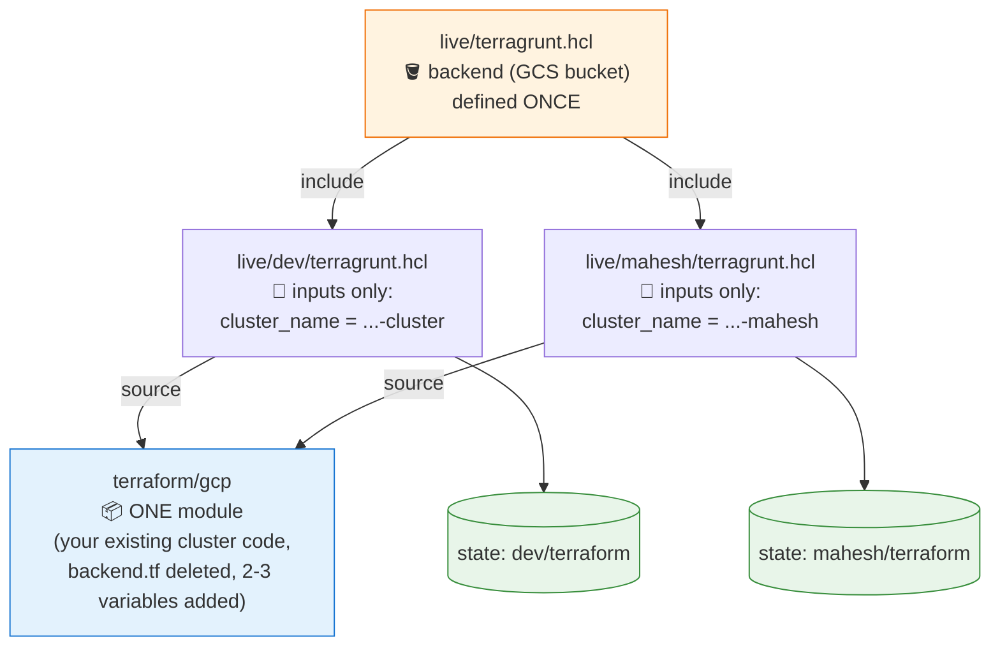

# Terragrunt: Simplest Starting Point for This Repo

**Goal:** kill the `terraform/gcp` vs `terraform/gcp-mahesh` duplication. Don't change any infrastructure — one shared module, one tiny config file per environment. Hub-and-spoke networking can come later.

## The mental model

**1 module + 1 root + N tiny env files.** Root owns the backend; each env owns only its inputs; both point at the same module.



Recall it as: **root = backend, env = inputs, module = resources.** Each env gets its own state prefix automatically via `path_relative_to_include()`.

## Step 1 — Parameterize the existing module

In `terraform/gcp`:

- **Delete `backend.tf`** (Terragrunt will generate it).
- Replace hardcoded values with variables:

```hcl
variable "project_id"   { type = string }
variable "cluster_name" { type = string }

provider "google" {
  project = var.project_id
  region  = "us-central1"
}

resource "google_container_cluster" "crack_detection" {
  name = var.cluster_name
  # ...everything else unchanged
}
```

## Step 2 — Add the live tree

```
live/
  terragrunt.hcl          # root: backend, defined once
  dev/terragrunt.hcl      # replaces terraform/gcp usage
  mahesh/terragrunt.hcl   # replaces terraform/gcp-mahesh entirely
```

```hcl
# live/terragrunt.hcl
remote_state {
  backend  = "gcs"
  generate = { path = "backend.tf", if_exists = "overwrite" }
  config = {
    bucket  = "crack-detection-terraform-1"
    prefix  = "${path_relative_to_include()}/terraform"
    project = "concrete-detection-8"
  }
}
```

```hcl
# live/dev/terragrunt.hcl
include "root" { path = find_in_parent_folders("terragrunt.hcl") }

terraform { source = "${get_repo_root()}/terraform/gcp" }

inputs = {
  project_id   = "concrete-detection-8"
  cluster_name = "crack-detection-cluster"
}
```

`live/mahesh/terragrunt.hcl` is the same file with different `inputs` — that's the whole `gcp-mahesh` folder replaced by ~10 lines.

## Step 3 — Run and verify

```bash
cd live/dev
terragrunt init
terragrunt plan    # success = "No changes"
```

**Zero-migration trick:** for the first env, set the state `prefix` to match your existing one (`gke/terraform`) and `terragrunt init` adopts your current state as-is. A clean "No changes" plan is your proof it works.

Then both environments at once:

```bash
cd live
terragrunt run-all plan
```

## What you get

| Before | After |
|---|---|
| 2 copied folders, drift between them | 1 module, diffs visible in 10-line input files |
| `backend.tf` hand-edited per copy | generated; state prefix automatic per env |
| New env = copy folder, edit everywhere | new env = new folder + inputs block |

**Next steps when ready:** extract variables for zone/machine-type, add an `env.hcl` layer, then introduce hub-and-spoke networking module by module.
