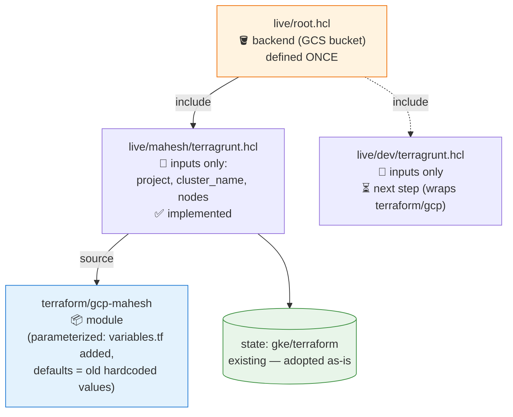

# Terragrunt: Getting Started in This Repo

**Status: implemented** on branch `usingTerragruntSamplePseudoCodeChanges` for the `mahesh` environment. This doc is both the rationale and the documentation of what's in place.

**Goal:** kill the `terraform/gcp` vs `terraform/gcp-mahesh` duplication. No infrastructure changes — one shared module, one tiny config file per environment. Hub-and-spoke networking can come later.

## The mental model

**1 module + 1 root + N tiny env files.** Root owns the backend; each env owns only its inputs; both point at the same module.



Recall it as: **root = backend, env = inputs, module = resources.**

## Current layout

```
terraform/
  gcp/                      # GKE — project concrete-detection-8 (plain Terraform, untouched)
  gcp-mahesh/               # GKE — project concrete-detection-1-491711 (parameterized, Terragrunt-managed)
  gcp-bootstrap/            # run-once foundation: APIs, SA + IAM, DNS, state bucket (concrete-detection-8)
  gcp-bootstrap-mahesh/     # same, for concrete-detection-1-491711
  digitalocean/             # DOKS alternative
  digitalocean-mahesh/      # DOKS alternative, mahesh copy
live/
  root.hcl                  # backend, defined once
  mahesh/terragrunt.hcl     # env config: source + inputs
runTerragrunt.sh            # wrapper: plan | apply | destroy | output
```

### What is under `terraform/gcp`?

The original GKE configuration for project `concrete-detection-8`, still plain Terraform:

| File | Contents |
|---|---|
| `main.tf` | `google` provider (project/region hardcoded); `google_container_cluster.crack_detection` — zonal cluster in `us-central1-a`, default VPC, default node pool removed, REGULAR release channel; outputs `cluster_name`, `kubectl_config` |
| `nodepool-autoscaling.tf` | `google_container_node_pool.primary` — `e2-medium`, 20 GB `pd-standard`, autoscaling 3–7 nodes, cloud-platform scope |
| `backend.tf` | GCS backend: bucket `crack-detection-terraform-1`, prefix `gke/terraform` |
| `README.md` | Original flow: run bootstrap first, then `terraform init -backend-config=...` + `apply` |

`terraform/gcp-mahesh` is the same cluster shape for project `concrete-detection-1-491711` (bucket `crack-detection-terraform`), now **parameterized**.

## Step 1 — Parameterize the module (✅ done for gcp-mahesh)

- `variables.tf` added: `project_id`, `region`, `zone`, `cluster_name`, `network`, `subnetwork`, `deletion_protection`, `machine_type`, `disk_size_gb`, `min_node_count`, `max_node_count` — **every default equals the old hardcoded value**, so plain `terraform plan` stays a no-op.
- `main.tf` / `nodepool-autoscaling.tf` reference the variables.
- `backend.tf` kept for plain-Terraform compatibility; Terragrunt overwrites it (`if_exists = "overwrite"`) in its `.terragrunt-cache` copy.

## Step 2 — The live tree (✅ done)

```hcl
# live/root.hcl  (named root.hcl so `run-all` never treats it as a runnable unit)
remote_state {
  backend  = "gcs"
  generate = { path = "backend.tf", if_exists = "overwrite" }
  config = {
    bucket = "crack-detection-terraform"   # existing gcp-mahesh bucket
    prefix = "gke/terraform"               # matches existing prefix -> zero migration
  }
}
```

```hcl
# live/mahesh/terragrunt.hcl
include "root" { path = find_in_parent_folders("root.hcl") }

terraform { source = "${get_repo_root()}/terraform/gcp-mahesh" }

inputs = {
  project_id     = "concrete-detection-1-491711"
  region         = "us-central1"
  zone           = "us-central1-a"
  cluster_name   = "crack-detection-cluster"
  deletion_protection = false
  machine_type   = "e2-medium"
  disk_size_gb   = 20
  min_node_count = 3
  max_node_count = 7
}
```

## Step 3 — Run and verify

```bash
./runTerragrunt.sh           # init + plan (default, safe)
./runTerragrunt.sh apply     # confirmation prompt
./runTerragrunt.sh output    # kubectl_config command
./runTerragrunt.sh destroy
```

Or manually: `cd live/mahesh && terragrunt init && terragrunt plan`.

**Zero-migration trick:** the state prefix is kept at `gke/terraform`, so `terragrunt init` adopts the existing state as-is. A clean **"No changes"** plan is the proof it works.

## What you get

| Before | After |
|---|---|
| 2 copied folders, drift between them | 1 module per env, diffs visible in small input files |
| `backend.tf` hand-edited per copy | generated by `root.hcl` |
| New env = copy folder, edit everywhere | new env = new folder + inputs block |

## Next steps (not done yet)

1. Migrate `terraform/gcp` the same way: add `variables.tf`, create `live/dev/terragrunt.hcl` with its bucket (`crack-detection-terraform-1`) and project (`concrete-detection-8`).
2. With two envs, move bucket/prefix per env (e.g. `env.hcl` files), switch prefix to `${path_relative_to_include()}/terraform`, and migrate state once (`terragrunt init -migrate-state`).
3. Collapse `gcp` + `gcp-mahesh` into one `terraform/modules/gke` module; later add hub-and-spoke networking module by module.
